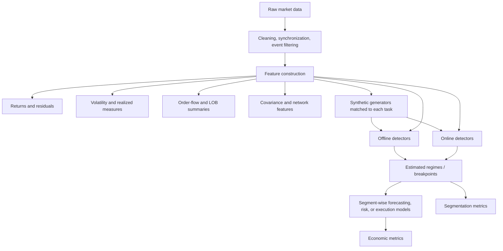
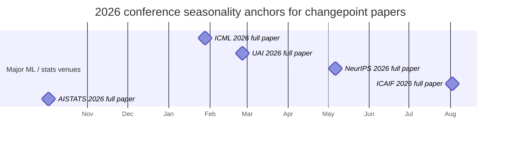

# Changepoint Detection for Regime Shifts in Quantitative Finance

## Executive summary

Changepoint detection is best viewed as a **family of tools for deciding when a model should stop trusting old data**. In quantitative finance, that framing is more useful than treating changepoints as a purely statistical end in themselves. The central empirical question is not only whether a method finds break dates accurately, but whether those break dates improve **risk estimation, volatility forecasting, portfolio allocation, execution quality, and drawdown control** once they are fed into downstream models.

Across the last decade, the field has broadened from classical structural-break tests and exact penalized segmentation toward **distributional, multivariate, high-dimensional, online, and representation-learning approaches**. The most credible conclusion from the literature is that **no single method dominates**. Exact penalized-cost methods remain the strongest offline baseline when the within-segment model is well specified. Bayesian online methods remain the cleanest framework for streaming detection with uncertainty quantification. Kernel, energy, density-ratio, and optimal-transport methods are most promising when regime shifts are genuinely **distributional** rather than simple mean or variance shifts. High-dimensional and panel-data methods are essential once the cross-section is large. Deep-learning approaches are promising for complex multivariate structure, but in finance they still face calibration, interpretability, and out-of-domain robustness problems.

For quant applications, the most promising use cases are:

- **volatility and covariance regime shifts**, where changepoints can trigger selective re-estimation of risk models;
- **structural breaks in factor exposures and cross-sectional residual structure**, where panel-aware methods matter more than univariate tests;
- **online order-flow and market-impact state detection**, where false-alarm control and latency matter more than retrospective breakpoint precision;
- **adaptive portfolio and risk systems**, where a changepoint layer determines when to refresh forecasts, shrinkage intensity, covariance windows, or leverage constraints.

The user-provided proposal appears especially relevant here. Based on the earlier review performed in this conversation, the uploaded proposal PDF frames changepoint detection as a **global optimization problem over segment boundaries using Wasserstein distance, with Wasserstein Proximal Coordinate Gradient–style updates**. That is a scientifically promising direction for finance because real market regime shifts often change **shape, tail behavior, or dependence structure** without producing a clean change in mean. But it is still a proposal-stage idea in the material available here, not a completed benchmark paper. Its main research risks are **computational scaling**, **dependence-aware calibration**, and **model selection for the number and minimum length of segments**.

The strongest research program in this area is therefore a **three-layer benchmark stack**:

1. **controlled synthetic data** with known break structure and realistic finance pathologies;
2. **public market data** for reproducible offline and online comparisons;
3. **downstream economic evaluation** using volatility loss, VaR/CVaR coverage, turnover, slippage, and net Sharpe after costs.

That stack is the organizing principle of the six concrete experiments proposed below. If executed well, it would support either a **methodology paper** for AISTATS / ICML / NeurIPS / JRSS-B / JASA / Journal of Econometrics, or an **application paper** for ICAIF / Journal of Financial Econometrics / Journal of Computational Finance, depending on whether the main contribution is algorithmic or financial.

## Key references at a glance

This is a short prioritized reference list before the full reference section.

- **Bai & Perron (1998, 2003)** on multiple structural breaks in econometrics: foundational for regression-style break analysis and still highly relevant in finance.
- **Killick, Fearnhead & Eckley (2012)** on PELT: the canonical exact-penalized offline segmentation baseline.
- **Matteson & James (2014)** on nonparametric multivariate changepoints: crucial for distributional shifts beyond mean/variance.
- **Adams & MacKay (2007)** on Bayesian Online Changepoint Detection: the cleanest starting point for streaming finance applications.
- **Fryzlewicz (2014)** and **Baranowski, Chen & Fryzlewicz (2019)** on WBS / NOT: scalable multiscale offline baselines.
- **Truong, Oudre & Vayatis (2020)**: still the most useful broad review across offline and online settings.
- **Wang & Samworth (2018 / arXiv version)**: important for sparse high-dimensional changepoint estimation.
- **Inclán & Tiao (1994)** on variance shifts and ICSS: still relevant for volatility-regime baselines.
- **Hamilton (1989)** on regime switching: not a changepoint method, but a mandatory adjacent benchmark for finance.

## Literature review and method comparison

The changepoint literature is easier to understand if separated along four axes:

- **offline vs online**: retrospective segmentation vs sequential alarms;
- **parametric vs distributional**: changes in a modeled mean/variance/regression vs changes in the full distribution;
- **low-dimensional vs high-dimensional/panel**: scalar or small-vector series vs large cross-sections;
- **likelihood-driven vs representation-driven**: explicit statistical models vs learned features.

The literature over the last decade has not invalidated older methods. Rather, it has clarified where each family belongs.

### Seminal older works that still matter

The older foundations remain indispensable.

- **Barry & Hartigan (1993)** established a Bayesian product-partition perspective that still influences posterior segmentation and uncertainty quantification.
- **Bai & Perron (1998, 2003)** formalized multiple structural breaks in linear models and remain the natural starting point for factor-exposure and macro-finance break analysis.
- **Hamilton (1989)** is not a changepoint paper, but regime-switching models remain a critical baseline whenever latent persistence matters more than exact break dating.
- **Inclán & Tiao (1994)** gave the ICSS variance-shift framework, which continues to matter for volatility-regime baselines.

These older references still matter because finance is one of the few domains where the distinction between **dated structural breaks** and **persistent latent states** remains operationally important.

### What changed in the last decade

The last decade’s main advances were not one single algorithmic breakthrough. They were a **broadening of the object being detected**:

- from mean shifts to **distributional shifts**;
- from low dimension to **high-dimensional and panel** settings;
- from retrospective segmentation to **online detection with false-alarm control**;
- from hand-specified likelihoods to **kernel, distance-based, and learned representations**.

The most useful recent synthesis remains the review by Truong, Oudre, and Vayatis (2020), but the literature has grown beyond any single review, especially in high-dimensional online settings and deep learning.

### Method comparison

Complexity bounds below are deliberately given as **rough order-of-magnitude profiles**, because practical runtime depends heavily on candidate sets, pruning, windowing, kernel approximations, and implementation details.

| Method family | Representative sources | Typical target | Key assumptions | Typical metrics in papers | Complexity profile | Strengths | Weaknesses | Heavy-tail / nonstationarity robustness |
|---|---|---|---|---|---|---|---|---|
| **Classical structural-break econometrics** | Bai & Perron (1998, 2003) | Changes in regression coefficients, means, variances | Piecewise parametric model; weak dependence / HAC-type regularity | breakpoint error, sup-Wald / LR statistics, model selection criteria, forecast loss | Often `O(M T^2)` for `M` breaks after precomputation; efficient implementations exist | Interpretable; strong inferential tradition; finance-friendly for factor and macro models | Narrow shift class; limited for generic distributional changes | Moderate at best unless robustified; sensitive to misspecified likelihood and outliers |
| **Exact penalized-cost segmentation** | Killick et al. (2012) | Offline piecewise-constant or piecewise-parametric segmentation | Additive segment cost; penalty choice; approximate within-segment homogeneity | precision/recall/F1, Hausdorff distance, segmentation loss, forecast loss | PELT has expected linear cost under pruning conditions, worst-case quadratic | Exact or near-exact segmentation; strong baseline; interpretable | Cost function must match the actual break type; penalty calibration matters | Depends on the segment loss; robust losses can help, but Gaussian versions are fragile |
| **Multiscale scan / recursive segmentation** | Fryzlewicz (2014); Baranowski et al. (2019) | Multiple breaks, short segments, scalable offline detection | Local signal identifiability; thresholding / screening choices | detection power, localization error, F1, runtime | Near-linear to low-order superlinear in practice | Fast; effective with many breaks; good practical baselines | More tuning; not globally optimal in the same sense as exact DP | Moderate; robustness depends on the test statistic used |
| **Bayesian offline segmentation** | Barry & Hartigan (1993); Fearnhead (2006) | Posterior over break configurations | Prior over break process and segment model | posterior mode accuracy, posterior uncertainty, predictive log score | Exact recursions can be efficient but still grow quickly without pruning/truncation | Uncertainty quantification; model averaging; natural segmentation posterior | Computational overhead; model misspecification can be severe | Moderate if heavy-tailed likelihoods are used; weak otherwise |
| **Bayesian online detection** | Adams & MacKay (2007) | Streaming changes with run-length posteriors | Hazard model; predictive likelihood choice | average run length, false-alarm rate, expected delay, online log score | Naive quadratic in horizon; practical versions use truncation or capped run lengths | Elegant online uncertainty framework; good for real-time risk/execution monitoring | Likelihood choice is crucial; long-memory and dependence are awkward | Moderate with Student-\(t\) or robust predictive models; not automatically robust |
| **Energy / distance-based nonparametrics** | Matteson & James (2014) | Distributional changes in multivariate series | Mild moment conditions; enough local sample size | segmentation accuracy, Rand index, power against generic alternatives | Often quadratic in segment length due to pairwise distances unless approximated | Detects mean, variance, and shape changes without parametric likelihood | Runtime can be high; dependence-aware calibration is nontrivial | Better than Gaussian likelihood methods under heavy tails; still needs care with dependence |
| **Kernel methods** | kernelized CPD literature summarized in Truong et al. (2020) | Generic distributional changes via RKHS embeddings | Kernel choice; local sample size; dependence handling | detection power, MMD-like two-sample separation, F1, runtime | Often quadratic unless low-rank / random-feature approximations are used | Flexible for subtle distributional shifts | Sensitive to kernel choice and bandwidth; scaling can be difficult | Good for non-Gaussian structure in principle; practical robustness depends on calibration |
| **Optimal transport / Wasserstein approaches** | emerging OT-based CPD literature; user-uploaded proposal [Local Sources] | Distributional and geometric changes, especially moment-invariant shifts | Distance geometry meaningful; enough local observations; transport approximation quality | breakpoint F1, Wasserstein separation, clustering quality, runtime-memory frontier | Can be expensive; exact OT is typically superlinear to cubic in local sample size without approximation | Particularly promising when mean/variance barely move but shape/tails/dependence do | Computational cost; dependence-aware thresholds and model selection are open problems | Potentially strong for heavy-tailed, distributional shifts; still an active research area |
| **High-dimensional sparse projection** | Wang & Samworth (2018 / arXiv) | Large-\(p\) mean or sparse structural changes | Sparsity or other structure in the signal | localization error, support recovery, F1, phase-transition style results | Dominated by projection/optimization plus segmentation; scalable if sparsity is exploitable | Essential when cross-section is large; theoretically appealing | Often targeted most directly at mean shifts; covariance shifts are harder | Better than naive low-dimensional methods, but robustness remains model dependent |
| **High-dimensional covariance / dependence breaks** | modern covariance-break literature in stats/econometrics | Risk, contagion, correlation-regime changes | Enough effective sample size for covariance estimation; structured alternatives | covariance estimation loss, break accuracy, risk forecast error, VaR/CVaR | Heavy in memory and matrix operations; bootstrap often expensive | Directly relevant for portfolio risk and stress detection | Data-hungry; unstable if \(p \gg n\) without structure | Often better than mean-shift methods for risk tasks; still delicate under heavy tails |
| **Panel / common-break methods** | Bai-style panel break frameworks in econometrics | Common or partially common breaks across assets/firms | Shared break structure; panel regularity assumptions | break-date error, coverage, post-break forecast gains | Moderate to heavy depending on factor estimation and search scheme | Natural for factor investing and cross-sectional instability | Real panels rarely break fully in common; partial pooling is hard | Moderate; robustness hinges on panel model and residual dependence control |
| **Deep-learning CPD** | recent NeurIPS / ICML / AISTATS sequence-model papers | Complex multivariate nonlinear changes, LOB and sensor-like data | Sufficient training data; stable train/test representation; architecture inductive bias | F1 at tolerance, AUC, detection delay, downstream task loss | Training cost dominates; typically GPU-bound | Flexible feature learning; can model nonlinear and multiscale structure | Calibration, interpretability, label scarcity, and domain shift remain major issues | Usually weak unless explicitly robustified; finance domain shift is a serious concern |

### Analytical takeaways from the literature

A few conclusions emerge consistently.

**Exact penalized-cost methods still deserve to be the default offline baseline.**  
A surprising number of recent papers do not beat well-tuned PELT or multiscale scan methods in the settings those baselines were built for. If the break is approximately piecewise parametric and the data are not huge, you should assume PELT or WBS / NOT will be hard to beat until proven otherwise.

**Finance pushes the literature hardest where assumptions are weakest.**  
Financial data are heavy-tailed, serially dependent, heteroskedastic, asynchronous, and often contaminated by changing microstructure. That means purely Gaussian, iid, or low-dimensional assumptions rarely hold literally. In practice, finance often requires one of three defenses:

1. a **robustified cost or likelihood**;
2. a **distributional detector** rather than a mean-shift detector;
3. a **downstream evaluation** that asks whether imperfect break dates still improve decisions.

**Adjacent regime models remain mandatory baselines.**  
For quant applications, changepoint detection should almost always be compared against a **Markov-switching or HMM-type regime model**. These models answer a slightly different question, but in portfolio allocation, macro timing, and volatility forecasting, they often remain harder to beat than a paper built only against naive rolling windows.

**Deep learning is not yet the default choice for finance CPD.**  
Deep detectors are attractive where feature dimensionality and nonlinear structure are severe, especially in LOB and ultra-high-frequency state inference. But calibration, sample efficiency, and robustness under distribution drift remain weaker than in classical baselines. In finance, that means deep learning should generally be treated as a **competitive benchmark or second-stage representation layer**, not the unquestioned starting point.

## Applications to quantitative finance

The best way to map changepoint methods into quant finance is by **task** and **data type**, not by mathematical elegance.

### Method-to-task map

| Finance task | Typical data type | Most natural CPD families | Why they fit | Main caveats |
|---|---|---|---|---|
| **Market regime detection** | daily or weekly returns, macro/factor panels | PELT, WBS/NOT, Bai–Perron, BOCPD, HMM benchmark | Macro and factor regimes are often piecewise stable enough for offline segmentation, but online monitoring is also useful | “True” regimes are latent; qualitative event labeling can be overfitted |
| **Volatility shifts** | daily realized volatility, intraday volatility curves | ICSS, functional break tests, kernel/OT detectors, BOCPD | Volatility breaks can be abrupt and economically meaningful; curve shape often matters as much as level | Intraday seasonality and microstructure noise can create spurious breaks |
| **Structural breaks in factor exposures** | daily panel regressions, rolling betas, cross-sectional slopes | Bai–Perron, panel/common-break methods, sparse high-dimensional detectors | This is the natural econometric use case for formal structural-break machinery | Asset entry/exit and reconstitution can generate fake breaks |
| **Covariance / contagion regime shifts** | multivariate daily returns, realized covariance matrices | high-dimensional covariance-break methods, sparse projection, OT/kernel on dependence features | Risk systems care more about covariance structure than mean | Covariance is data-hungry; crisis clustering produces many near-duplicate breaks |
| **Market microstructure state detection** | tick trades, order flow, depth, queue imbalance, LOB features | BOCPD, robust online detectors, high-dimensional online methods, deep sequence models | Execution and surveillance require real-time alarms | False alarms are expensive; latency matters; labels are weak |
| **Portfolio allocation** | daily cross-asset data, factor returns, macro state variables | offline detectors plus selective model refits; HMM benchmark | CPD can decide when to refresh covariance windows, leverage, or exposure estimates | Turnover and transaction costs can erase paper gains |
| **Risk management** | daily/intraday returns, scenario/risk-factor panels | covariance-break methods, BOCPD, robust offline re-segmentation | Regime-aware recalibration can improve VaR/CVaR and stress monitoring | Evaluation must be on coverage and loss, not just break F1 |
| **Algorithmic trading / execution** | tick/intraday flow and impact data | BOCPD, robust online detectors, Hawkes-aware state detection, deep LOB models | Detecting current execution state matters more than historical segmentation | Ground truth is unclear; queue dynamics and venue outages are confounders |

### Data-type map

| Data type | Best first-line CPD baseline | Strong alternatives | Why |
|---|---|---|---|
| **Tick / event time** | BOCPD or robust online detector | deep sequence models, Hawkes-aware detectors | Streaming, uncertain, latency-sensitive, heavy-tailed |
| **Intraday bars / curves** | functional or multiscale offline detector | kernel / OT / deep sequence detector | Changes often affect shape and dependence, not only level |
| **Daily multivariate returns** | PELT or WBS/NOT on parametric or robust costs | OT/kernel/energy methods, HMM baseline, covariance-break detectors | Good balance of interpretability, reproducibility, and compute |
| **Cross-sectional / panel** | common-break or sparse high-dimensional detector | factor-break models, score-based WBS | Shared instability across many assets is rarely captured by univariate methods |

### Practical finance lessons

Three practical lessons are worth stating explicitly.

First, **volatility and covariance tasks are usually better CPD targets than return-mean tasks**. Mean forecasting is weak and unstable in most liquid markets. By contrast, volatility, covariance, residual dependence, and factor exposure instability are more measurable and often more economically relevant.

Second, **market microstructure applications are fundamentally online problems**. A method that is excellent offline but has poor false-alarm properties online is often not useful for execution or surveillance.

Third, **distributional shifts matter**. A crisis often changes the shape of returns, the clustering of order flow, the cross-asset dependence graph, and the tail structure more than it changes the unconditional mean. That is why kernel, energy, and Wasserstein ideas are particularly promising in finance.

## Datasets for reproducible research

The table below separates public and proprietary data because reproducibility is a major issue in finance CPD work.

| Dataset / source | Access | Frequency | Best use cases | Notes |
|---|---|---|---|---|
| [Kenneth French Data Library](https://mba.tuck.dartmouth.edu/pages/faculty/ken.french/data_library.html) | Public | daily / monthly | factor regimes, portfolio allocation, structural breaks in factor loadings | Strong public baseline for daily studies |
| [FRED](https://fred.stlouisfed.org/) | Public | daily / monthly / quarterly | macro-finance regime covariates, rates, spreads, recession proxies | Useful companion to French factors |
| [Binance public data / Binance Vision](https://data.binance.vision/) | Public | tick / minute / daily | intraday volatility, order flow, public high-frequency benchmark | Crypto microstructure is not the same as equities, but it is reproducible |
| [LOBSTER](https://lobsterdata.com/) | Licensed | message / order book events | LOB regime shifts, execution and market-impact research | Excellent structure, but proprietary |
| [CRSP](https://www.crsp.org/) | Licensed | daily / monthly / delisting-aware panels | cross-sectional asset pricing, panel break tests, factor instability | Standard institutional dataset for equity panels |
| Compustat (licensed via S&P Global) | Licensed | quarterly / annual / some daily links via merged panels | firm characteristics, panel breaks in cross-sections | Useful with CRSP for panel instability work |
| TAQ / exchange-level trade and quote data | Licensed | tick | microstructure and intraday structural breaks | Expensive but important for equity execution studies |
| CME DataMine or similar futures archives | Licensed | tick / intraday | macro event windows, futures microstructure and volatility curves | Strong for event-rich, liquid contracts |

## Experimental agenda

The most credible empirical program is to benchmark at three levels:

1. **statistical recovery on synthetic data with known truth**;
2. **reproducible public market datasets**;
3. **economic downstream utility**.

That avoids the two weak-paper failure modes in this field:

- excellent synthetic break F1 with no financial relevance;
- backtest gains with no credible evidence that the break detector is doing anything real.

### Experimental pipeline

### Comparative table of proposed experiments

| Experiment | Data | Public / proprietary | Main shift type | Core models | Main economic endpoint | Compute |
|---|---|---|---|---|---|---|
| **Daily cross-asset regime segmentation** | French factors + FRED + VIX-type daily series | Public | mean / beta / covariance | PELT, WBS/NOT, BOCPD, HMM, OT/Wasserstein | forecast log score, turnover-adjusted performance | CPU |
| **Intraday volatility-pattern breaks** | Binance minute data; optionally licensed equities/futures | Public fallback / partly proprietary | intraday curve shape and volatility state | functional breaks, ICSS, kernel CPD, deep sequence baselines | QLIKE, VaR coverage | CPU + optional GPU |
| **Tick-level order-flow and impact regimes** | Binance events or LOBSTER | Binance public / LOBSTER licensed | microstructure state, intensities, impact | BOCPD, robust online CPD, deep sequence models | slippage and impact RMSE | CPU, low-latency, optional GPU |
| **High-dimensional covariance contagion shifts** | ETF universe or CRSP-like panel | Public fallback / proprietary | correlation blocks, covariance and graph shifts | covariance-break methods, sparse projection, rolling/HMM benchmark | portfolio variance and CVaR forecast | CPU + memory |
| **Panel factor-instability detection** | CRSP–Compustat or portfolio-level public proxies | Mostly proprietary | common and partial breaks in exposures | panel/common-break methods, score-based multiscale methods | post-break alpha retention and forecast stability | CPU |
| **OT/Wasserstein proposal benchmark** | synthetic + public daily/intraday + aggregated LOB features | Mixed | moment-invariant distributional changes | uploaded proposal vs energy/kernel/PELT/WBS | break quality and downstream volatility/risk | CPU + likely GPU or OT acceleration |

### Experiment details

#### Daily cross-asset regime segmentation

**Question.** Does explicit break detection improve daily forecasting and allocation relative to rolling windows and HMM-style regime baselines?

**Datasets.** Use the Kenneth French data library for factors and industry portfolios, combined with FRED macro/rate/spread series and a public implied-volatility proxy if available. This is fully reproducible.

**Preprocessing.** Align trading calendars, convert to excess returns where appropriate, standardize only within rolling training samples to avoid leakage, and run both raw-data and residual-based variants. A useful variant is to fit simple AR or GARCH filters first and detect breaks on residuals or filtered volatility.

**Synthetic generators.** Piecewise Student-\(t\) VAR or VAR-GARCH with controlled breaks in unconditional mean, factor loadings, and covariance. Include both large crisis breaks and smaller stealth breaks.

**Models and baselines.** PELT, WBS/NOT, Bai–Perron-style regression breaks, BOCPD on suitable predictive likelihoods, a Markov-switching baseline, and the OT/Wasserstein proposal if implemented.

**Evaluation.** Breakpoint precision/recall with tolerance windows, Hausdorff distance, forecast log score, volatility loss, realized Sharpe, maximum drawdown, and turnover-adjusted return.

**Expected pitfalls.** The main ones are look-ahead normalization, using crisis dates as “truth” after the fact, and confusing volatility clustering with true structural breaks.

**Compute.** Easily manageable on 16–32 CPU cores unless very large hyperparameter sweeps are run.

#### Intraday volatility-pattern breaks

**Question.** Are changes in the *shape* of intraday volatility more informative than simple daily variance breaks?

**Datasets.** Use Binance minute data for a public benchmark. If licensed intraday equity or futures data are available, add them as a second benchmark, but note the proprietary nature explicitly.

**Preprocessing.** Convert each day to an intraday volatility curve or feature vector, remove time-of-day seasonality, and evaluate both raw curves and lower-dimensional bases such as splines or functional principal components.

**Synthetic generators.** Functional stochastic-volatility generators with regime switches in curve shape: opening spike intensification, loss of noon lull, closing auction stress, or jump frequency changes.

**Models and baselines.** Functional change tests, ICSS on realized daily volatility, multiscale segmentation of curve coefficients, kernel CPD, and one deep sequence baseline.

**Evaluation.** Breakpoint accuracy, predictive QLIKE, VaR exceedance coverage, calibration drift across segments, and robustness to sampling frequency.

**Expected pitfalls.** Crypto is 24/7 and microstructure differs from equities; intraday seasonality removal can itself create or erase breaks; jumps and outages can contaminate volatility estimates.

**Compute.** Moderate CPU compute; one GPU helps for deep baselines but is not required.

#### Tick-level order-flow and impact regimes

**Question.** Can online changepoint detection improve impact prediction and execution-state awareness?

**Datasets.** Use LOBSTER if licensed; otherwise use Binance trade and book snapshots in event time. If the precise book-snapshot granularity is unspecified, say so in the paper rather than assuming it.

**Preprocessing.** Engineer signed trade flow, spread, depth imbalance, queue imbalance, event intensity, and short-horizon impact measures. Use event time rather than wall-clock time where appropriate.

**Synthetic generators.** Marked Hawkes or queue-reactive simulators with regime switches in arrival intensity, cancellation intensity, resiliency, and impact shape.

**Models and baselines.** BOCPD with robust predictive likelihoods, a robust online detector with capped or clipped updates, rolling Z-score alarms, and a deep LOB baseline if data volume supports it.

**Evaluation.** Average run length under the null, expected detection delay, false positives during quiet periods, impact RMSE, realized slippage, and execution-cost degradation under missed alarms.

**Expected pitfalls.** Ground truth is weak; scheduled data releases can masquerade as latent break states; missing packets or exchange outages can trigger false alarms.

**Compute.** Latency-sensitive multicore CPU setup is most important; a GPU is optional.

#### High-dimensional covariance contagion shifts

**Question.** Do covariance-aware changepoint methods improve risk estimation enough to matter economically?

**Datasets.** Public ETF universes can serve as a reproducible fallback. If CRSP or other licensed panels are available, they give a broader, more realistic testbed.

**Preprocessing.** Remove or model conditional mean at a low level, estimate robust covariance summaries, and test both raw returns and transformed dependence features such as correlation matrices, precision-matrix estimates, or network summaries.

**Synthetic generators.** Sparse-factor \(t\)-copula systems with breaks in correlation blocks, sector connectivity, latent-factor variance, and contagion strength.

**Models and baselines.** High-dimensional covariance-break routines, sparse-projection methods on transformed summaries, rolling covariance windows, and HMM-style covariance switching.

**Evaluation.** Covariance forecast loss, portfolio variance forecast, realized CVaR, stress-period tracking error, turnover induced by boundary resets, and crisis false-negative rates.

**Expected pitfalls.** Covariance is noisy when \(p\) is large; break detectors can over-segment crises into many small contiguous events; public ETF panels may understate true equity cross-sectional complexity.

**Compute.** Memory-intensive but GPU-free; 64–128 GB RAM is realistic for large sweeps.

#### Panel factor-instability detection

**Question.** Can panel-aware break methods identify deterioration in factor exposures or characteristic slopes before it becomes obvious in aggregate returns?

**Datasets.** Ideally CRSP–Compustat or another licensed merged panel. If unavailable, use portfolio-sorted public proxies and state explicitly that asset-level panel detail is missing.

**Preprocessing.** Build rolling asset-level or portfolio-level factor exposures, handle asset entry/exit carefully, and separately analyze common breaks, sectoral breaks, and idiosyncratic residual-network breaks.

**Synthetic generators.** Interactive-effects panel models with both common and idiosyncratic break dates, plus changing residual dependence.

**Models and baselines.** Bai-style common-break methods, factor-break procedures, sparse multiscale methods on score processes, and simple rolling-regression instability baselines.

**Evaluation.** Break-date error on synthetic data, post-break factor forecast stability, alpha decay, and out-of-sample cross-sectional prediction.

**Expected pitfalls.** Index reconstitution, delistings, and missing characteristics can create artificial breaks; common-break assumptions are often too strong in real equity universes.

**Compute.** Moderate to heavy CPU, depending on panel size and factor structure.

#### OT/Wasserstein proposal benchmark

**Question.** When do optimal-transport-style global boundary updates beat classical and kernel-style changepoint methods?

**Datasets.** Use all three tiers: synthetic data, public daily factor/macro data, and at least one intraday or microstructure-style feature dataset.

**Preprocessing.** Enforce minimum segment lengths, use dependence-aware resampling or block bootstrap for thresholding/calibration, and specify the break-count penalty rather than choosing the number of breaks after the fact.

**Synthetic generators.** The most important generator here should preserve first and second moments while changing higher-order shape, multimodality, or copula structure. Examples include two-component mixtures with swapped weights, matched-mean-variance skewness changes, and copula breaks with unchanged marginals.

**Models and baselines.** The uploaded OT/Wasserstein proposal, energy-distance segmentation, kernel CPD, PELT with robust losses, WBS/NOT, and an HMM benchmark for downstream tasks.

**Evaluation.** Breakpoint F1, Hausdorff distance, cluster separation of segments, runtime-memory frontier, and downstream gains in volatility/covariance forecasting.

**Expected pitfalls.** Exact OT scaling, sensitivity to local sample size, brittleness under serial dependence, and difficulty choosing the number of breaks. These are the key obstacles between a good idea and a publishable contribution.

**Compute.** This is the one experiment where OT approximation engineering may materially matter; strong CPU and possibly GPU acceleration are useful.

## Synthetic generators for controlled tests

The choice of synthetic generator determines whether a benchmark is meaningful. A good finance-oriented CPD benchmark should not use only Gaussian mean shifts.

| Generator | What it tests | Best matched experiments |
|---|---|---|
| **Piecewise Student-\(t\) VAR / VAR-GARCH** | heavy tails, mean and covariance breaks, volatility clustering | daily cross-asset regimes |
| **Functional stochastic-volatility curves** | intraday shape changes rather than scalar variance changes | intraday volatility breaks |
| **Marked Hawkes / queue-reactive simulator** | event intensities, clustering, resiliency, and microstructure state changes | tick-level order flow |
| **Sparse-factor \(t\)-copula model** | correlation and contagion shifts with heavy tails | covariance contagion shifts |
| **Interactive-effects panel with common + idiosyncratic breaks** | partial commonality and factor instability | panel factor-instability |
| **Moment-preserving distribution shift generator** | changes invisible to mean/variance detectors | OT / kernel / energy benchmark |

A strong paper should report results separately on:

- **obvious breaks** that many methods can find;
- **subtle breaks** that are distributional rather than mean-shift-based;
- **false-positive control** under long no-change stretches;
- **downstream utility** even when segmentation is imperfect.

## Research directions and testable hypotheses

The table below ranks research directions by **novelty**, **feasibility**, and **potential impact in quantitative finance**.

| Priority | Direction / hypothesis | Novelty | Feasibility | Impact |
|---|---|---|---|---|
| **Highest** | **Distributional, moment-invariant regime shifts matter economically.** Methods based on OT, kernels, or energy distance should beat mean/variance detectors when regimes differ mainly in tail shape, multimodality, or dependence. | High | Medium | High |
| **Highest** | **A multiscale regime stack beats single-scale detection.** Jointly modeling tick, intraday, and daily breaks should improve both execution-state awareness and medium-horizon risk forecasting. | High | Medium | High |
| **High** | **Break-aware covariance estimation adds more value than break-aware mean forecasting.** The economic gains should show up first in volatility, covariance, and CVaR metrics rather than in raw return forecasts. | Medium | High | High |
| **High** | **Panel-aware break detection can identify factor instability earlier than index-level CPD.** Common or sectoral cross-sectional breaks should appear before broad market-level dates become obvious. | Medium | Medium | High |
| **Medium** | **Online robust CPD is underused in finance.** Heavy-tail-aware online detectors should reduce false alarms in order-flow and execution monitoring relative to Gaussian BOCPD or threshold heuristics. | Medium | High | Medium-High |
| **Medium** | **Deep CPD needs explicit calibration and invariance design.** Finance-tailored deep detectors should enforce uncertainty calibration and market-structure invariances instead of only maximizing benchmark F1. | High | Medium-Low | Medium-High |

### Evaluation of the uploaded proposal

Based on the earlier file review performed in this conversation, the user-uploaded proposal is strongest if positioned around the first hypothesis above: **distributional breaks that are hard to see in moments but visible in transport geometry**. That is a real gap in finance, especially for:

- covariance and dependence shifts,
- volatility-curve shape changes,
- microstructure state changes with similar first moments,
- cross-sectional residual-distribution changes.

For the proposal to become a strong paper, it needs four things:

1. **A clear break-count and minimum-segment selection rule.**  
   Without this, comparisons against penalized methods are likely to be viewed as unfair.

2. **Dependence-aware calibration.**  
   Financial data inside segments are rarely iid. Thresholding, uncertainty statements, or penalties should account for serial dependence.

3. **OT approximation engineering.**  
   Entropic regularization, sliced OT, low-rank approximations, or efficient local transport computations may determine whether the method is practically competitive.

4. **A finance-relevant downstream case.**  
   The paper will be stronger if it shows that additional sensitivity to distributional shifts improves volatility, covariance, or execution decisions — not only synthetic segmentation scores.

A clean hypothesis set for that paper would be:

- **H1.** OT/Wasserstein segmentation outperforms PELT and Bai–Perron when the true regime shift preserves mean and variance but changes shape, tails, or dependence.
- **H2.** The downstream gain from OT-style segmentation is larger for volatility and covariance tasks than for mean-return tasks.
- **H3.** The method is most competitive offline or in mini-batch updating, rather than in the hardest ultra-low-latency online setting.
- **H4.** Runtime-performance tradeoffs are driven more by OT approximation choice than by the exact coordinate-update schedule.

## Target conferences and journals

The venue strategy should depend on whether the contribution is primarily **methodological**, **econometric**, or **financially applied**.

### Conference and journal fit

| Venue | Best fit for this project | What the submission should emphasize | Timing note |
|---|---|---|---|
| [NeurIPS](https://neurips.cc/) | algorithmic CPD method with strong benchmarks | methodological novelty, scalability, broad benchmark suite | 2026 call was in early May; use as seasonality anchor for 2027 |
| [ICML](https://icml.cc/) | theory + scalable ML method | proofs, clear ablations, strong synthetic and real-data results | 2026 full-paper timing was late January; verify 2027 once posted |
| [AISTATS](https://aistats.org/) | statistically grounded CPD, Bayesian, kernel/OT methods | clean method paper with theory and careful experiments | 2026 full-paper timing was early October of the prior year |
| [UAI](https://www.auai.org/) | Bayesian online CPD, uncertainty, probabilistic modeling | posterior inference, uncertainty calibration, online evaluation | 2026 seasonality was late February |
| [KDD](https://kdd.org/) | large-scale benchmarking or systems-oriented application | scale, deployment realism, benchmarks, engineering | check annual cycle carefully because dates can vary by track/cycle |
| [ICAIF](https://ai-finance.org/) | finance-specific ML application | concrete financial value, market data realism, execution/risk use case | 2026 paper timing was early August |

| Journal | Best fit | What would make it competitive |
|---|---|---|
| [JRSS-B](https://academic.oup.com/jrsssb) | statistically rigorous new methodology | nontrivial theory, clear inferential contribution, serious empirical design |
| [JASA](https://www.tandfonline.com/journals/uasa20) | statistical methodology with broad applied importance | methodological originality plus convincing applications |
| [Journal of Econometrics](https://www.sciencedirect.com/journal/journal-of-econometrics) | structural breaks, high-dimensional or panel econometrics | econometric identification, asymptotics, panel/covariance structure |
| [Econometrica](https://onlinelibrary.wiley.com/journal/14680262) | only if the contribution is a major econometric advance | foundational theory rather than mainly empirical benchmarking |
| [Journal of Financial Econometrics](https://academic.oup.com/jfec) | finance + changepoint methodology | strong financial application with econometric depth |
| [Journal of Computational Finance](https://www.risk.net/journal-of-computational-finance) | execution, risk systems, numerical OT/online methods | practical numerical contribution plus market relevance |
| [Journal of Finance](https://onlinelibrary.wiley.com/journal/15406261) | only if the financial mechanism is central | major economic question, not just better segmentation |
| [Review of Financial Studies](https://academic.oup.com/rfs) | top-end finance application | economically important result with strong identification or broad asset-pricing relevance |

### Submission seasonality timeline

Exact 2027 dates may be unposted. The chart below uses 2026 schedules as seasonality anchors.

### Recommended publication routing

A sensible two-paper strategy would be:

- **Paper A: methodology / benchmark paper.**  
  Target AISTATS, ICML, NeurIPS, JRSS-B, JASA, or Journal of Econometrics. The contribution should be the method itself, theory if available, and a reproducible benchmark suite.

- **Paper B: finance application paper.**  
  Target ICAIF, Journal of Financial Econometrics, or Journal of Computational Finance. The contribution should be a financial decision problem — for example, regime-aware covariance estimation or intraday impact-state detection — where the changepoint layer is shown to improve a real downstream objective.

That split is often more publishable than trying to force one paper to satisfy both the top-tier statistical audience and the finance-application audience simultaneously.

## Open questions and limitations

Several limitations should be acknowledged explicitly.

**The uploaded PDFs are local/private sources.**  
Because public bibliographic metadata were not provided in the conversation, they cannot be cited here with complete external references. The report incorporates the earlier review of the proposal PDF, but the exported Markdown necessarily cites it descriptively.

**Deep-learning coverage is necessarily more selective than older method families.**  
The deep CPD literature is growing quickly but is less canonized than structural-break econometrics, PELT, or BOCPD. That makes “the” key deep paper hard to define. In finance, the more important point is often not the exact architecture but whether the method is calibrated, robust under domain drift, and better than simpler baselines.

**Ground truth is intrinsically weak in real markets.**  
Break dates are usually latent and only imperfectly aligned with macro events or crisis narratives. That is why purely segmentation-based metrics are insufficient.

**Reproducibility depends heavily on data access.**  
Daily public data are abundant. Asset-level equity panels and high-quality equity limit-order-book data are not. Any serious paper should separate public reproducible results from proprietary extensions.

## References

### Core changepoint and regime references

- Barry, D., and Hartigan, J. A. (1993). *A Bayesian Analysis for Change Point Problems*. Journal of the American Statistical Association. DOI: [10.1080/01621459.1993.10594323](https://doi.org/10.1080/01621459.1993.10594323)

- Bai, J., and Perron, P. (1998). *Estimating and Testing Linear Models with Multiple Structural Changes*. Econometrica. Stable link: [JSTOR 2998540](https://www.jstor.org/stable/2998540)

- Bai, J., and Perron, P. (2003). *Computation and Analysis of Multiple Structural Change Models*. Journal of Applied Econometrics. DOI: [10.1002/jae.659](https://doi.org/10.1002/jae.659)

- Hamilton, J. D. (1989). *A New Approach to the Economic Analysis of Nonstationary Time Series and the Business Cycle*. Econometrica. Stable link: [JSTOR 1912559](https://www.jstor.org/stable/1912559)

- Inclán, C., and Tiao, G. C. (1994). *Use of Cumulative Sums of Squares for Retrospective Detection of Changes of Variance*. Journal of the American Statistical Association. DOI: [10.1080/01621459.1994.10476824](https://doi.org/10.1080/01621459.1994.10476824)

- Fearnhead, P. (2006). *Exact and Efficient Bayesian Inference for Multiple Changepoint Problems*. Statistics and Computing. DOI: [10.1007/s11222-006-8450-8](https://doi.org/10.1007/s11222-006-8450-8)

- Adams, R. P., and MacKay, D. J. C. (2007). *Bayesian Online Changepoint Detection*. arXiv: [0710.3742](https://arxiv.org/abs/0710.3742)

- Killick, R., Fearnhead, P., and Eckley, I. A. (2012). *Optimal Detection of Changepoints With a Linear Computational Cost*. Journal of the American Statistical Association. DOI: [10.1080/01621459.2012.737745](https://doi.org/10.1080/01621459.2012.737745)

- Matteson, D. S., and James, N. A. (2014). *A Nonparametric Approach for Multiple Change Point Analysis of Multivariate Data*. Journal of the American Statistical Association. DOI: [10.1080/01621459.2013.849605](https://doi.org/10.1080/01621459.2013.849605)

- Fryzlewicz, P. (2014). *Wild Binary Segmentation for Multiple Change-Point Detection*. Annals of Statistics. DOI: [10.1214/14-AOS1245](https://doi.org/10.1214/14-AOS1245)

- Baranowski, R., Chen, Y., and Fryzlewicz, P. (2019). *Narrowest-Over-Threshold Detection of Multiple Change Points and Change-Point-Like Features*. Journal of the Royal Statistical Society Series B. DOI: [10.1111/rssb.12322](https://doi.org/10.1111/rssb.12322)

- Truong, C., Oudre, L., and Vayatis, N. (2020). *Selective Review of Offline Change Point Detection Methods*. Signal Processing. DOI: [10.1016/j.sigpro.2019.107299](https://doi.org/10.1016/j.sigpro.2019.107299)

- Wang, T., and Samworth, R. J. (2018; arXiv version 2016). *High Dimensional Change Point Estimation via Sparse Projection*. arXiv: [1606.09917](https://arxiv.org/abs/1606.09917)

### Data sources

- Kenneth French Data Library: <https://mba.tuck.dartmouth.edu/pages/faculty/ken.french/data_library.html>

- FRED, Federal Reserve Economic Data: <https://fred.stlouisfed.org/>

- Binance public data / Binance Vision: <https://data.binance.vision/>

- LOBSTER: <https://lobsterdata.com/>

- CRSP: <https://www.crsp.org/>

### Venue pages

- NeurIPS: <https://neurips.cc/>

- ICML: <https://icml.cc/>

- AISTATS: <https://aistats.org/>

- UAI: <https://www.auai.org/>

- KDD: <https://kdd.org/>

- ICAIF: <https://ai-finance.org/>

- JRSS-B: <https://academic.oup.com/jrsssb>

- JASA: <https://www.tandfonline.com/journals/uasa20>

- Journal of Econometrics: <https://www.sciencedirect.com/journal/journal-of-econometrics>

- Econometrica: <https://onlinelibrary.wiley.com/journal/14680262>

- Journal of Finance: <https://onlinelibrary.wiley.com/journal/15406261>

- Review of Financial Studies: <https://academic.oup.com/rfs>

- Journal of Financial Econometrics: <https://academic.oup.com/jfec>

- Journal of Computational Finance: <https://www.risk.net/journal-of-computational-finance>
