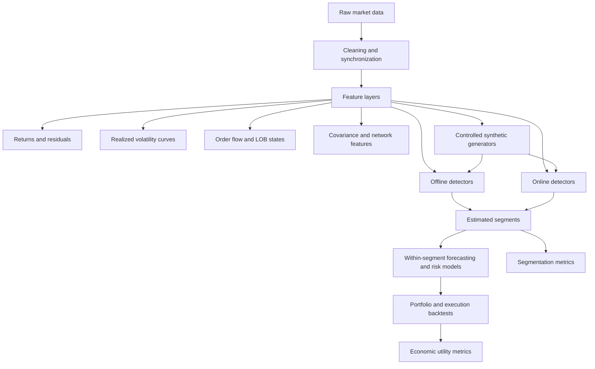
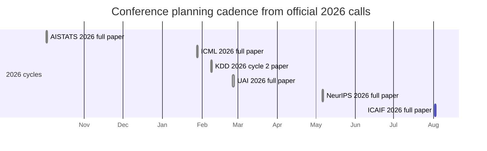

# Changepoint Detection for Regime Shifts in Quantitative Finance

## Executive summary

Changepoint detection is now a mature interdisciplinary toolkit rather than a single method family. The most reliable conclusion from the last decade is that **method choice should be driven by the type of regime shift one actually cares about**: exact penalized-cost and structural-break methods remain strongest for offline, piecewise-parametric segmentation; Bayesian online methods are the cleanest framework for real-time alarms; kernel, energy, density-ratio, and optimal-transport methods are most attractive when the shift is genuinely distributional rather than just a change in mean or variance; sparse/high-dimensional methods are necessary once the cross-section is large; and deep methods are useful mainly when there is enough data to learn invariant representations and when theory can be partially traded for feature power. No single family dominates across all of these settings. citeturn4search2turn5search2turn35view0turn18search2turn35view1turn31view4turn31view3turn33view1

For quantitative finance, the most promising applications are **not** generic “find breaks in returns” exercises. The highest-value uses are: regime-aware volatility and covariance modeling; structural breaks in factor exposures and cross-sectional residual structure; online order-flow and market-impact state detection; and adaptive portfolio/risk systems that re-estimate models only when a statistically material break occurs. These settings fit the stylized facts of financial data—heavy tails, dependence, asynchronous sampling, unequal segment lengths, stress clustering, and unobserved latent regimes—better than one-dimensional iid break tests do. Adjacent latent-regime models such as Markov switching remain important practical baselines, especially when persistence and smoothing matter more than exact break dating. citeturn7search14turn5search3turn33view2turn33view3turn34view5turn37search4turn7search11

The uploaded PDF is intellectually well aligned with this frontier. It proposes reframing changepoint detection as a **global optimization over segment boundaries using Wasserstein distances**, with optimization inspired by Wasserstein Proximal Coordinate Gradient theory. That is a promising direction precisely because financial regime shifts are often distributional and can be weakly visible in first or second moments. But the current upload is a **proposal rather than a completed empirical paper**: implementation, calibration, and benchmarking remain open, and the main risks are computational scaling, serial dependence within segments, and principled model selection for the number of breaks. fileciteturn1file0 citeturn33view0turn31view0turn20search1

My bottom-line recommendation is to organize research around a **three-layer benchmark stack**. First, use synthetic generators with known breaks to measure segmentation accuracy and robustness. Second, test on public financial data where repeatable baselines are possible. Third, decide winners by downstream utility—forecast log score, volatility loss, VaR/CVaR calibration, slippage, turnover, and net Sharpe—not by changepoint F1 alone. The six experiments proposed below are designed to do exactly that. citeturn4search2turn33view2turn33view3turn27search11

## Literature and method landscape

The recent literature is best understood as six interacting traditions. The **statistics/econometrics lineage** emphasizes exact or asymptotically justified segmentation under explicit within-segment models; the **Bayesian lineage** emphasizes posterior uncertainty and online updating; the **nonparametric ML lineage** emphasizes distributional two-sample comparisons; the **high-dimensional lineage** emphasizes sparse projections, bootstrap calibration, and dependence; the **panel/factor lineage** emphasizes common breaks across many units; and the **deep-learning lineage** emphasizes learned representations and benchmark performance. The seminal older references that still structure the field are Barry–Hartigan’s product-partition Bayesian view, Bai–Perron structural breaks, Hamilton-style regime switching as an adjacent benchmark, Fearnhead’s exact Bayesian recursions, and the early kernel/two-sample perspective that later blossomed into modern MMD, density-ratio, and OT-based detectors. Over roughly 2016–2026, the center of gravity shifted toward pruning-based exact inference, multiscale scans, sparse/high-dimensional theory, and richer distributional detectors. citeturn18search1turn17search4turn16search13turn15search2turn16search7turn18search2turn4search2turn5search12turn6search3

A useful practical distinction is between **offline segmentation** and **online detection**. Offline methods answer: “where were the breaks after seeing the whole sample?” Online methods answer: “how quickly can I alarm after a break while controlling false alarms?” Finance needs both. Daily portfolio allocation, factor instability, and macro-regime analysis are mostly offline or batched; execution, market-impact, quote-to-trade conversion, and intraday risk controls are online. The literature’s theoretical metrics mirror that split: offline papers focus on estimation consistency and breakpoint localization; online papers focus on false-alarm control, patience/average run length, and detection delay. citeturn35view0turn18search3turn31view3turn22search6

Most papers still rely on some form of **within-segment regularity**—iid observations, weak dependence, finite moments, or parametric likelihood correctness. That point matters in finance because raw returns, order flow, and realized measures violate these assumptions routinely. Heavy-tail robustness is therefore uneven across the literature. Energy-based methods are attractive because Matteson–James require only existence of an $\alpha$-th absolute moment for some $\alpha \in (0,2)$; self-normalized high-dimensional tests explicitly accommodate weak temporal dependence; and clipped-SGD online detection gives finite-sample false-positive guarantees under only bounded second moments. By contrast, many classic least-squares, Gaussian, kernel, and deep detectors are only as robust as their preprocessing and calibration. citeturn35view1turn35view2turn22search6turn5search2

| Method family | Representative methods | Typical setting | Core assumptions | Rough computational profile | Heavy-tail / nonstationarity robustness | Main strengths | Main weaknesses |
|---|---|---|---|---|---|---|---|
| Exact penalized-cost / dynamic programming | PELT, exact DP | Offline, univariate to moderate multivariate | Additive segment cost; approximate within-segment parametric model | PELT is linear under pruning conditions, but exact methods can be quadratic or worse in hard cases | Weak by default; robust if loss/cost is changed | Exact segmentation, interpretable penalties, strong baseline | Can miss rich distributional shifts if the cost is too narrow |
| Recursive multiscale scans | Binary Segmentation, WBS, NOT, MOSUM-style methods | Offline, many breaks, scalable settings | Signal separability or local identifiability | Near-linear to low-order superlinear in practice | Moderate; robustness depends on test statistic and thresholding | Fast, easy to implement, good for many breaks and short spacings | More tuning, less globally optimal than exact DP |
| Classical econometric structural breaks | Bai–Perron, sup-Wald, ICSS | Regression, variance, panel common-break settings | Piecewise linear or variance model; usually weak dependence/HAC-type conditions | Typically quadratic global search for fixed break counts; efficient implementations exist | Limited unless robustified | Excellent interpretability and inference for finance/econometrics | Narrower shift class than modern distributional methods |
| Bayesian offline / online | Barry–Hartigan, Fearnhead, BOCPD | Offline posterior segmentation; online alarms | Prior on break process and segment model | Exact recursions are elegant but can grow quickly without truncation/approximation | Moderate if likelihood is well chosen; otherwise fragile | Posterior uncertainty, natural online updating, regime persistence | Model misspecification hurts; long-stream scaling needs care |
| Kernel / energy / density-ratio / OT | M-statistic, energy/e-divisive, RuLSIF, Wasserstein tests | Offline or online, nonparametric shift detection | Two-sample distinguishability; kernel/metric choice; enough local sample size | Ranges from near-linear approximations to quadratic pairwise costs; OT may be expensive | Better for generic distributional shifts; still needs careful calibration under dependence | Detects mean, variance, shape, and copula changes | Thresholding and runtime can be difficult; dependence complicates theory |
| High-dimensional sparse projection | Inspect, multiscale online high-dim detection, self-normalization | \(p \gg n\), sparse/dense mean shifts | Sparsity or structured alternatives; weak dependence in extensions | Usually dominated by projection/optimization plus segmentation; designed for large \(p\) | Better than low-dim methods, but target is often mean-shift specific | Strong theory in large cross-sections; finance-ready for factor/residual panels | Less general for covariance or shape shifts |
| High-dimensional covariance / multivariate likelihood | Covariance-break bootstrap, SUBSET | Multivariate risk/regime/correlation shifts | Covariance or parametric likelihood structure | Can be heavy because covariance estimation scales poorly in \(p\) | Some bootstrap-calibrated robustness; dependence handled better than classic tests | Directly targets risk and contagion structure | More data-hungry; harder hyperparameter calibration |
| Panel / factor common-break methods | Bai common breaks, interactive-effects break models, factor break methods | Cross-sectional panels, factor instability | Common or partially common breaks; factor structure | PCA/least-squares plus break search; moderate to heavy | Moderate | Well suited to factor investing and large equity panels | Real-world panel changes are often only partially common |
| Deep representation-learning detectors | KL-CPD, autoencoder CPC, MSSA-style deep sequence models | Complex multivariate series, LOB, sensor-like data | Training data representativeness; architecture inductive bias | Training dominated by epochs × sequence model cost; often GPU-bound | Flexible empirically, but theoretical robustness is weaker | Strong benchmark performance on complex nonlinear patterns | Calibration, interpretability, and out-of-domain stability remain weak |

The table above synthesizes the original method papers and recent reviews rather than reproducing a single source. Exact DP/PELT, WBS, NOT, energy statistics, BOCPD, density-ratio estimation, KL-CPD, Inspect, self-normalization, high-dimensional online detection, covariance-break bootstrap, SUBSET, and common-break panel methods collectively span the major design space. citeturn35view0turn34view1turn36search0turn35view1turn18search2turn35view3turn33view1turn31view4turn35view2turn31view3turn34view5turn34view7turn37search4turn4search2turn5search12

For evaluation, I would separate **segmentation metrics**, **online detection metrics**, and **economic metrics**. Segmentation metrics should include tolerance-window precision/recall/F1, mean or median absolute break-date error, Hausdorff distance, and segment-clustering agreement where applicable. Online detection should emphasize average run length or patience under the null, false-positive probability, and expected detection delay after a true break. Finance experiments should then add forecast and decision metrics: log score, volatility loss, VaR/CVaR coverage, portfolio variance forecast error, slippage, turnover, drawdown, and net Sharpe after costs. The crucial point is that good breakpoint recovery does **not** automatically imply economic usefulness. citeturn31view3turn22search6turn33view2turn33view3turn27search11

## Quant finance applications

In finance, changepoint detection is most useful when it is treated as a **state-estimation layer** that decides when to re-specify a downstream model. The natural downstream objects are volatility models, covariance estimators, factor exposures, execution/impact models, and risk limits. This view reconciles classical structural-break econometrics with modern ML: the break detector need not “solve finance” on its own; it needs to create segments in which forecasting, optimization, or execution models are closer to valid. citeturn6search3turn5search2turn7search14

The most important adjacent model class is **regime switching**. Hamilton-style Markov switching and its finance descendants smooth over state changes instead of forcing discrete dated breaks. That makes them useful as baselines for portfolio allocation and macro/volatility forecasting. But for event dating, stress monitoring, and post-break re-estimation, changepoint methods are often preferable because they do not require a fully persistent latent-state model and can handle local, nonrecurrent, or asymmetrically sized shifts more naturally. In practice, a strong finance benchmark suite should therefore include both changepoint and HMM/regime-switching baselines. citeturn15search2turn7search14

| Finance task | Typical data type | Best-matched method families | Why they fit | Main caveats |
|---|---|---|---|---|
| Market regime detection in returns | Daily/weekly multivariate returns, macro + factors | PELT / WBS / NOT, Bai–Perron, BOCPD, HMM benchmark | Good for abrupt shifts in mean, beta, variance regime, or macro sensitivity | Real-market “ground truth” regimes are latent and noisy |
| Volatility shifts and volatility-pattern changes | Daily RV/VIX, intraday volatility curves | ICSS, functional break tests, kernel/OT detectors, deep sequence models | Volatility changes are often shape changes, not only level changes | Microstructure noise, seasonality, and jumps confound detection |
| Structural breaks in factor exposures | Daily panel or cross-sectional regressions | Common-break panel methods, sparse/high-dim tests, factor-break methods | Directly targets instability in risk premia and characteristic slopes | Panel membership changes and survivorship matter |
| Correlation / covariance contagion shifts | Daily multivariate or realized covariance data | High-dimensional covariance-break tests, sparse projections, SUBSET | Closest to risk management and portfolio-construction needs | Covariance estimation is data-hungry and unstable in stress periods |
| Market microstructure regime shifts | Tick trades, order flow, depth, LOB features | BOCPD, robust online detectors, high-dim online methods, deep LOB models | Real-time alarm quality matters more than retrospective fit | Labels are scarce; outages and venue effects create spurious alarms |
| Portfolio allocation and drawdown control | Daily cross-asset, macro, volatility, covariance | Offline detectors + rolling re-estimation; HMM as benchmark | Break-aware re-estimation can reduce stale-parameter risk | Over-trading and look-ahead bias are constant risks |
| Algorithmic trading / execution | Tick/intraday order flow and impact | Online BOCPD, robust heavy-tail online CPD, Hawkes-aware detectors | Matches the need to detect execution-state changes quickly | False alarms are expensive; latency and compute budgets matter |

This mapping is strongly supported by the available finance-specific literature: Bai–Perron-style breaks and ICSS are still natural for daily volatility and regression problems; functional break tests are attractive for intraday volatility curves; score-driven BOCPD works well for order flow and market impact; high-dimensional covariance break methods are directly relevant to risk systems; and recent cross-sectional work suggests that changepoints in stock-return panels are economically persistent and not fully absorbed by classical factor models. citeturn5search3turn33view3turn33view2turn34view5turn37search4turn7search11

Data accessibility matters as much as methodology. Public daily-factor and macro data are plentiful through the Kenneth French library and FRED. Public high-frequency crypto data are increasingly usable through Binance archives. But many of the most valuable equity microstructure and panel datasets—LOBSTER, TAQ, CRSP, Compustat—remain proprietary or institutionally licensed. The Oxford-Man realized library, once a convenient public realized-volatility benchmark, is no longer available from its original host, which affects reproducibility for volatility-break studies. citeturn25search0turn25search4turn30search0turn30search1turn25search3turn30search5turn25search2turn27search9turn27search14turn25search1

## Experimental agenda

The right experimental design in this area is hierarchical: start from synthetic data with known break structure, move to public market data, and end with economic backtests. That avoids the two standard failure modes of CPD-for-finance papers: overclaiming from synthetic accuracy alone, or overclaiming from superficial PnL improvements with no breakpoint benchmark at all. The pipeline below is the benchmark architecture I recommend. citeturn4search2turn33view2turn33view3turn33view0turn1file0

| Experiment | Core question | Primary dataset | Public / proprietary | Synthetic generator | Main baselines | Decision metric |
|---|---|---|---|---|---|---|
| Daily cross-asset regime segmentation | Do breaks improve regime-aware daily forecasting and allocation? | Ken French factors/industries + FRED macro/VIX | Public | Piecewise Student-\(t\) VAR-GARCH with breaks in mean, beta, and covariance | PELT, WBS/NOT, BOCPD, Inspect, HMM, OT/Wasserstein | Forecast log score, realized Sharpe, drawdown |
| Intraday volatility-pattern breaks | Are shape changes in intraday volatility more informative than daily variance breaks? | Binance minute data; equity/futures intraday if licensed | Public fallback; equities often proprietary | Functional SV / rough-vol curves with seasonal-shape breaks | Functional break tests, ICSS, kernel CPD, KL-CPD | QLIKE, VaR coverage, date error |
| Tick-level order-flow and impact regimes | Can online CPD improve impact prediction and execution control? | LOBSTER or Binance trades + book snapshots | LOBSTER proprietary; Binance public | Marked Hawkes / queue-reactive simulator with regime shifts | Score-driven BOCPD, robust online CPD, reactive heuristics | Detection delay, impact RMSE, slippage |
| High-dimensional covariance contagion shifts | Do covariance-break detectors improve risk estimation? | ETF / sector daily returns; CRSP if available | Public ETF fallback; CRSP proprietary | Sparse-factor \(t\)-copula with covariance and graph breaks | Covariance-break bootstrap, SUBSET, Inspect, rolling covariance, HMM | Portfolio variance / CVaR forecast |
| Panel factor-instability detection | Can common-break methods detect cross-sectional alpha decay? | CRSP-Compustat or portfolio-sorted public proxies | Often proprietary | Panel with common + idiosyncratic slope breaks | Bai common-breaks, factor-break methods, WBS on panel scores | Post-break cross-sectional forecast / alpha retention |
| Wasserstein-WPCG proposal benchmark | When do OT-based global boundary updates beat test-based detectors? | Synthetic + daily factors + intraday curves + aggregated LOB features | Mixed | Moment-preserving distribution shifts invisible to first two moments | Cheng OT scan, energy, KL-CPD, PELT, WBS | Break F1, Hausdorff, runtime-memory frontier |

The table is a compact comparison; the six experiments below specify the full design choices and expected pitfalls. The dataset choices reflect what is genuinely available today: French and FRED are public, LOBSTER and major equity TAQ/CRSP-style sources are not, Binance archives are public, and Oxford-Man’s original realized library is discontinued. citeturn25search0turn25search4turn30search0turn25search2turn30search3turn25search3turn30search5turn27search9turn27search14turn25search1

**Experiment A — Daily cross-asset regime segmentation.**  
Use daily Kenneth French factors, industry portfolios, and public macro/risk series such as VIX and rates. Preprocess by aligning trading calendars, computing excess returns, winsorizing extreme outliers only if justified ex ante, and optionally residualizing with simple AR or GARCH layers so that “breaks in unconditional data” can be compared with “breaks in model residuals.” Synthetic controls should be Student-\(t\) VAR-GARCH models with breaks in conditional mean, beta, and covariance. Compare PELT, WBS/NOT, BOCPD, Inspect, a regime-switching HMM baseline, and the OT/Wasserstein proposal. Evaluate tolerance-window F1, Hausdorff distance, segment stability, forecast log score, and allocation metrics such as realized Sharpe, turnover, and drawdown. Expect the main pitfalls to be look-ahead normalization, crisis clustering that creates many near-duplicate breaks, and ex post macro labeling that tempts narrative overfitting. CPU-only compute with 16 cores and 32–64 GB RAM is enough. citeturn25search0turn25search4turn30search0turn27search1turn35view0turn34view1turn36search0turn18search2turn31view4turn33view0

**Experiment B — Intraday volatility-pattern breaks.**  
Use public minute-level crypto data from Binance Vision as the default reproducible benchmark; if licensed intraday equity or futures data are available, add them as a second benchmark but note explicitly that they are proprietary. Transform each day into an intraday volatility curve, remove known clock/calendar effects, and test both raw and basis-compressed versions. Synthetic generators should alter the *shape* of the intraday volatility profile, not just its level: for example, U-shaped profiles that flatten, noon-lull intensity that disappears, or sudden opening/closing jump intensification. Compare functional break tests, ICSS on daily realized volatility, kernel detectors, and KL-CPD. Use localization metrics plus QLIKE-style volatility forecasting loss, VaR exceedance calibration, and confidence-band stability. Pitfalls are microstructure noise, different market microstructure between 24/7 crypto and session-based equities, and sensitivity to the intraday grid. Moderate multicore CPU compute is sufficient; a single GPU helps only for deep baselines. citeturn33view3turn25search3turn30search5turn25search1turn5search3turn33view1

**Experiment C — Tick-level order-flow and market-impact regimes.**  
Use LOBSTER if available, because it provides reconstructed NASDAQ limit-order-book data; otherwise use public Binance trade and book archives and aggregate to event-time features. Preprocess signed order flow, spread, depth imbalance, queue lengths, inter-arrival times, and impact-response curves. Synthetic data should come from marked Hawkes or queue-reactive simulators with regime shifts in intensity, resiliency, and impact concavity. The central comparison is between score-driven BOCPD, robust heavy-tailed online detection, high-dimensional online detectors, and reactive baselines that use only order flow imbalance or volatility. Evaluate average run length, expected detection delay, impact forecast RMSE, and realized slippage in a constrained execution backtest. The main risks are missing ground truth, confounding scheduled announcements with latent microstructure stress, and excessive false alarms under venue outages or feed irregularities. This experiment is the most latency-sensitive; 32 CPU cores and substantial memory are helpful, and a GPU is optional for deep LOB baselines. citeturn33view2turn22search6turn31view3turn25search2turn25search10turn30search5

**Experiment D — High-dimensional covariance contagion shifts.**  
Use either a public ETF universe or broader CRSP-like daily equity returns if licensed. Prewhiten means, estimate robust covariance summaries, and feed the detector either raw return vectors or rolling covariance features. Synthetic data should be sparse-factor or \(t\)-copula systems with regime changes in correlation blocks, conditional heteroskedasticity, and precision-graph structure. Compare high-dimensional covariance-break methods, SUBSET, Inspect on transformed summaries, and rolling covariance/HMM baselines. Put the emphasis on *risk* outcomes: covariance forecast Frobenius error, realized portfolio variance, CVaR coverage, and stress-period turnover. The biggest pitfalls are \(p \gg n\) instability, repeated crisis sub-breaks, and confusing estimation noise with structural change. This is memory-intensive but does not require GPUs; 64–128 GB RAM is realistic. citeturn34view5turn34view7turn31view4turn27search14

**Experiment E — Panel factor-instability detection.**  
For asset-level work, this is usually proprietary because it needs CRSP/Compustat or equivalent panel data; if that is unavailable, public factor-sorted portfolios and developed-market portfolio panels are the minimum reproducible proxy. Build rolling factor exposures or cross-sectional slope estimates, control carefully for membership changes, and test for common versus partially common breaks. Synthetic data should include interactive effects and both common and idiosyncratic slope breaks so the experiment can distinguish truly panel-aware methods from naïve pooled detectors. Compare Bai common-break methods, factor-break procedures, and score-level WBS or NOT baselines. Evaluate break-date error, interval coverage where available, and downstream cross-sectional forecast or alpha-retention performance. The main empirical danger is that portfolio reconstitution, delistings, or sample-selection rules can create fake breaks. Medium-to-high CPU compute is adequate. citeturn37search4turn37search11turn37search16turn7search11

**Experiment F — Direct benchmark of the uploaded Wasserstein-WPCG proposal.**  
This should be the signature experiment if the goal is a publishable contribution. Use synthetic distributions where first and second moments are deliberately held fixed while skewness, multimodality, tail behavior, or dependence changes abruptly. Add real-data tests on daily factor returns, intraday volatility curves, and aggregated microstructure features. Preprocessing must include minimum-segment constraints, block bootstrap or dependence-aware resampling, and a clearly specified penalty or regularizer for the number of breaks. Compare the uploaded OT/WPCG approach against Cheng’s OT scan, energy statistics, KL-CPD, PELT, and WBS. The core metrics should be breakpoint F1, Hausdorff distance, false positives under no-change null blocks, segment-clustering quality, and runtime-memory trade-offs. The key hypothesis is simple: **OT-based global optimization should outperform moment-based baselines precisely when regime shifts are distributional but low-order moments are nearly unchanged.** The main risks are optimization over discrete boundaries, computational scaling of OT, and fragile calibration under serial dependence. This is the one experiment where 1–2 GPUs or very strong multicore CPU infrastructure may materially matter. fileciteturn1file0 citeturn33view0turn31view0turn20search1turn35view1turn33view1turn35view0turn34view1

## Research directions and evaluation of the uploaded proposal

The priorities below are ranked jointly by **novelty**, **feasibility**, and **likely impact on quant practice**.

| Priority | Research direction / hypothesis | Novelty | Feasibility | Potential impact |
|---|---|---|---|---|
| Highest | **Moment-invariant regime shifts matter.** In execution, cross-section, and intraday volatility, OT/kernel detectors should beat mean/variance detectors when the break is mainly in shape, tail behavior, or dependence. | High | Medium | High |
| Highest | **Multi-scale regime stacks outperform single-scale detectors.** A hierarchical detector that links tick, intraday, and daily breaks should improve both volatility forecasting and execution-state awareness. | High | Medium | High |
| High | **Break-aware covariance estimation improves portfolio risk more than it improves return forecasts.** The payoff from CPD will show up first in variance/CVaR calibration, not necessarily in Sharpe. | Medium | High | High |
| High | **Panel/common-break detection can identify factor-model instability before index-level detectors can.** Breaks in characteristic slopes and residual networks should precede obvious marketwide breaks. | Medium | Medium | High |
| Medium | **Online robust CPD is underused in finance.** Heavy-tail-robust online methods should materially reduce false alarms in order-flow surveillance relative to Gaussian BOCPD or simple Z-score alarms. | Medium | High | Medium-High |
| Medium | **Deep CPD needs calibration and invariance constraints.** Uncertainty-aware deep detectors with economic invariances should be more publishable and more usable than unconstrained benchmark-chasing models. | High | Medium-Low | Medium-High |

These priorities are consistent with where the literature is already strongest and where finance still has genuine gaps. The field already has good offline exact methods, good high-dimensional mean-shift theory, and emerging online robustness. The weaker points are distributional finance benchmarks, multi-scale designs, and panel-aware applications with convincing economic end points. citeturn35view0turn31view3turn22search6turn34view5turn37search4turn33view0turn33view1

The uploaded proposal fits best into the **highest-priority** bucket. Its main scientific wager is that **global OT-based boundary optimization can capture regime changes that sliding-window tests or moment-based methods miss**. That is a good wager, but to make it publishable the paper needs three additions. First, it needs a clear model-selection device for the number of breaks and minimum segment length. Second, it needs dependence-aware calibration, because financial observations inside a segment are rarely iid. Third, it needs runtime engineering—entropic, sliced, or low-rank OT approximations—so that the method is not dismissed as elegant but impractical. In its current form, I would evaluate it as a promising method proposal, not yet as a finished empirical contribution. fileciteturn1file0 citeturn31view0turn33view0turn20search1

A sharp hypothesis set for that proposal would be:

- **H1:** OT/WPCG beats PELT, WBS, and Bai–Perron when the true break preserves mean and variance but changes skewness, multimodality, tail weight, or copula structure.  
- **H2:** OT/WPCG is most competitive in offline segmentation and segment clustering, not in ultra-low-latency online alarms.  
- **H3:** After dependence-aware preprocessing, OT/WPCG improves downstream volatility and covariance forecasting more than downstream mean forecasting.  
- **H4:** The method’s practical viability depends more on computational approximation choice than on the exact WPCG update order.  

These are all testable with the experimental agenda above and would create a much stronger paper than a generic “our detector beats baselines on synthetic data” story. fileciteturn1file0 citeturn31view0turn33view0turn22search6turn34view5

## Publication strategy

For conferences, the natural split is: **methodology-first venues** for new theory/algorithms; **applied-ML venues** for scalable empirical benchmarks; and **finance-specialized venues** for microstructure, execution, and market applications. For journals, the cleanest framing is: JRSS-B/JASA for statistically rigorous methodology, Econometrica/Journal of Econometrics for structural-break econometrics with strong identification/inference, and finance journals for economic value and institutional relevance. Exact 2027 conference deadlines were not yet posted for all venues at the time of research, so the official 2026 dates below should be interpreted as reliable **seasonality anchors**, not guaranteed 2027 deadlines. citeturn8search0turn9search3turn8search16turn24search1turn24search3turn8search3turn11search12turn10search0turn12search0turn13search2turn10search3turn23search2turn29search1

| Venue | Fit for this topic | Best paper type | Official timeline signal |
|---|---|---|---|
| urlNeurIPS 2026turn8search0 | Strong if the contribution is algorithmic, scalable, and benchmark-rich | Method + broad benchmark | 2026 abstract May 4, full paper May 6; 2027 exact dates unposted |
| urlICML 2026turn9search3 | Strong for theory + algorithm + rigorous experiments | Methodology-heavy ML paper | 2026 abstract Jan 23, full paper Jan 28; annual cycle is early-year |
| urlAISTATS 2026turn8search16 | Excellent for statistically grounded CPD, Bayesian, kernel, and online methods | Statistics/ML method paper | 2026 full paper Oct 2, 2025; annual cycle is early autumn |
| urlUAI 2026turn24search1 | Strong for Bayesian online CPD, uncertainty, and probabilistic modeling | Bayesian / uncertainty-centric method paper | 2026 submission Feb 25; annual cycle is late winter |
| urlKDD 2026 Research Trackturn24search3 | Good if the emphasis is scale, systems, or benchmark application | Large-scale applied method / benchmark | 2026 cycle-2 paper Feb 8; two-cycle format matters |
| urlICAIF 2026turn8search3 | Best specialized conference fit for AI/finance execution and market-regime applications | Finance-focused ML application paper | 2026 full paper Aug 2 |

| Journal | Fit for this topic | Best paper type | Timeline |
|---|---|---|---|
| urlJRSS-Bturn11search12 | Excellent for methodological CPD with strong theory and practical relevance | New statistically rigorous method | Rolling submission |
| urlJASAturn10search0 | Excellent for statistical methodology with broader applied reach | Method + strong empirical study | Rolling submission |
| urlEconometricaturn12search0 | Appropriate only if the contribution is a major econometric advance | Fundamental structural-break econometrics | Rolling submission |
| urlJournal of Econometricsturn23search2 | Very strong for structural breaks, panels, covariance, and factor instability | Econometric method + finance application | Rolling submission |
| urlJournal of Financeturn13search2 | Appropriate only if the economic mechanism and asset-pricing implications are central | Finance paper with strong economic question | Rolling submission |
| urlReview of Financial Studiesturn10search3 | Strong if the regime-shift result changes finance conclusions materially | High-end empirical/theoretical finance | Rolling submission |
| urlJournal of Financial Econometricsturn29search1 | Probably the best specialized journal fit for finance + CPD | Financial econometrics with methodological depth | Rolling submission |
| urlJournal of Computational Financeturn28search1 | Good for execution, risk, and numerical OT/system details | Computational finance application | Rolling submission |

The best routing depends on the paper you actually write. A **Wasserstein-WPCG methodology paper** with proofs and carefully controlled simulations belongs first in AISTATS, ICML, NeurIPS, UAI, JRSS-B, JASA, or Journal of Econometrics. A **microstructure/order-flow paper** belongs first in ICAIF, KDD, Journal of Financial Econometrics, or Journal of Computational Finance. A **portfolio/risk paper** needs much stronger economic identification and would face a higher bar at Journal of Finance or Review of Financial Studies. citeturn8search0turn9search3turn8search16turn24search1turn24search3turn8search3turn11search3turn23search10turn29search1turn28search1

The official 2026 schedules imply the following planning cadence. Because exact 2027 calls were not yet posted across venues, this should be read as a reliable **submission seasonality map**.

## Open questions and limitations

Several details remain genuinely unspecified and should be treated as such rather than assumed. The uploaded PDF is a proposal, not a completed empirical paper, so its current contribution should be evaluated as a **research direction** rather than a finished benchmark result. fileciteturn1file0

Ground truth is the central empirical limitation in finance CPD. Real “regimes” are latent, often overlapping, and only partially aligned with crisis dates or macro events. That is why downstream utility—forecast calibration, risk control, and trading/execution outcomes—must sit alongside segmentation metrics in any serious finance study. citeturn7search14turn33view2turn33view3turn27search11

Reproducibility is the main data limitation. Public daily-factor and macro benchmarks exist, and public crypto high-frequency archives are improving, but the most useful equity microstructure and panel datasets are still institutionally licensed. Any paper in this area should therefore separate **public-reproducible results** from **proprietary-extension results**. citeturn25search0turn30search0turn25search3turn25search2turn27search9turn27search14

The final methodological limitation is that no detector is robust to arbitrary heavy tails, serial dependence, long memory, and nonstationarity all at once. Finance-facing work should therefore be explicit about which failure modes are being addressed: heavy tails, dependence, high dimensionality, online false alarms, or distributional shift beyond moments. The strongest research programs in this area are the ones that make that target precise and benchmark against the right competing family, not the ones that claim universal superiority. citeturn22search6turn35view2turn34view5turn4search2turn5search2