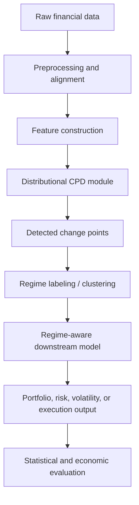
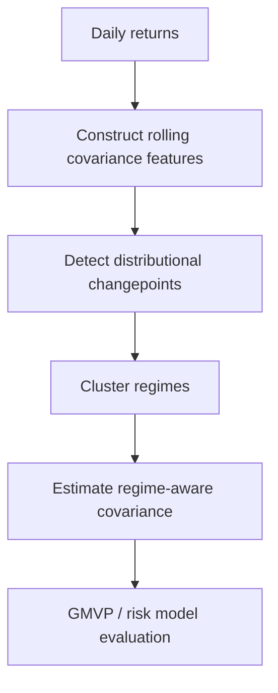

# Proposal: Distributional Regime Shift Detection via Wasserstein Change Point Optimization for Quantitative Finance

## 1. Executive Summary

Financial markets are not stationary. The statistical relationships used by trading, portfolio construction, volatility forecasting, and risk-management models can break abruptly or gradually across market regimes. These breaks are often not simple mean shifts. They may appear as changes in volatility clustering, tail behavior, cross-asset dependence, liquidity, market impact, or factor exposure stability.

This project proposes a research framework for **distributional change point detection (CPD)** in quantitative finance, with a focus on detecting **regime shifts** that are economically meaningful for downstream models. The core idea is to treat each market regime as a probability distribution over financial states, then detect boundaries by comparing adjacent segment distributions using optimal transport, especially Wasserstein distances.

Building on the current proposal, which formulates CPD as a **global Wasserstein segmentation problem** rather than a local sliding-window test, we propose extending the framework toward finance-specific applications: covariance forecasting, portfolio risk control, factor instability detection, and online market-state monitoring.

The central research question is:

> Can distributional change point detection identify financial regime shifts that improve downstream quant decisions, especially risk forecasting and portfolio allocation?

The project has three main contributions:

1. **Methodological contribution**: develop a global Wasserstein-based segmentation framework for detecting distributional market regime shifts.
2. **Finance-specific contribution**: adapt the detector to volatility, covariance, factor, and microstructure features.
3. **Empirical contribution**: evaluate not only statistical breakpoint accuracy, but also downstream economic value through covariance loss, GMVP performance, VaR/CVaR calibration, drawdown control, and turnover-adjusted returns.

---

## 2. Motivation

### 2.1 Why Change Point Detection Matters in Quant Finance

Many quant models rely on historical data. However, the usefulness of historical data depends on whether the market state has remained stable. When the underlying regime changes, old observations may become misleading.

Examples include:

- a low-volatility market transitioning into a crisis regime;
- equity correlations suddenly increasing during stress;
- factor premia decaying after crowding;
- liquidity evaporating during market shocks;
- market impact changing after volatility spikes;
- intraday order-flow behavior shifting after news or macro events.

In these cases, a model trained on stale data can suffer from:

- underestimated risk;
- poor covariance forecasts;
- excessive leverage;
- unstable portfolio weights;
- wrong hedge ratios;
- delayed response to volatility shocks;
- degraded execution performance.

Therefore, CPD should not be viewed only as a statistical task. In quant finance, its value comes from answering:

> When should a model stop trusting the previous regime and adapt?

### 2.2 Why Distributional CPD Instead of Mean-Shift CPD?

Classical change point methods often focus on changes in mean, variance, regression coefficients, or likelihood parameters. These are useful, but financial regime shifts are frequently more complex.

A market regime may change through:

\[
\text{tail thickness}, \quad
\text{skewness}, \quad
\text{cross-sectional dependence}, \quad
\text{volatility clustering}, \quad
\text{liquidity state}, \quad
\text{return distribution shape}.
\]

Two regimes may have nearly identical mean and variance but very different downside risk or dependence structure.

For example:

\[
r_t \sim \mathcal{N}(0, \sigma^2)
\]

and

\[
r_t \sim t_\nu(0, \tilde{\sigma}^2)
\]

can be scaled to have similar first two moments, yet the second distribution has much fatter tails. A mean-variance detector may miss the shift, while a distributional metric such as Wasserstein distance, energy distance, or MMD may detect it.

This motivates the use of **distributional CPD** methods that compare empirical distributions rather than only moments.

---

## 3. Background and Literature Review

### 3.1 Classical CPD

Classical CPD methods can be grouped into parametric and nonparametric families.

Parametric methods assume a generative model, such as piecewise Gaussian means, ARMA models, switching linear systems, or regression models with structural breaks. Important references include:

- Bai and Perron-style multiple structural break models;
- likelihood-ratio and generalized likelihood-ratio tests;
- PELT and other penalized dynamic-programming methods;
- Bayesian online change point detection;
- Markov-switching and hidden Markov models.

These methods are strong baselines when the model is well specified. However, they may miss breaks that do not appear in the chosen sufficient statistics.

### 3.2 Nonparametric and Distributional CPD

Nonparametric CPD avoids specifying a full generative model. Instead, it uses two-sample tests or distributional distances between adjacent windows or segments.

Representative families include:

- kernel methods using MMD;
- energy-distance methods;
- density-ratio based methods;
- rank-based multivariate methods;
- optimal-transport and Wasserstein methods.

These are especially appealing for finance because financial regimes can differ in tails, dependence, and shape.

### 3.3 Optimal Transport and Wasserstein CPD

The current project builds on optimal transport. Given two distributions \(p\) and \(q\), the 2-Wasserstein distance is

\[
W_2(p,q)
=
\left(
\inf_{\pi \in \Pi(p,q)}
\int \|x-y\|_2^2 \, d\pi(x,y)
\right)^{1/2},
\]

where \(\Pi(p,q)\) is the set of couplings with marginals \(p\) and \(q\).

In one dimension, \(W_2\) has a simple quantile representation:

\[
W_2^2(p,q)
=
\int_0^1
\left(F^{-1}(u)-G^{-1}(u)\right)^2du.
\]

This makes univariate and sliced-Wasserstein implementations computationally attractive.

The current uploaded proposal formulates CPD as maximizing the total Wasserstein distance between adjacent segment distributions:

\[
\max_{\tau}
J(\tau)
=
\sum_{i=1}^{S-1}
W_2^2(\mu_i(\tau), \mu_{i+1}(\tau)),
\]

where \(\tau\) denotes the set of change points and \(\mu_i(\tau)\) is the empirical distribution of segment \(i\).

This differs from local sliding-window methods because it optimizes the segmentation globally rather than scoring each candidate boundary independently.

### 3.4 Connection to Regime Modeling

Traditional regime models, such as HMMs or Markov-switching models, assume a latent state process. CPD takes a complementary view: it estimates the times at which the data-generating process changes.

For finance, the two views can be combined:

\[
\text{CPD} \rightarrow \text{segment regimes}
\rightarrow \text{regime-specific forecasting / allocation model}.
\]

The detected changepoints can initialize or regularize regime models. Conversely, HMM-like models can serve as strong baselines for comparing downstream value.

---

## 4. Research Problem

### 4.1 Problem Setup

Let

\[
X_1, X_2, \ldots, X_T
\]

be a time series of financial state vectors, where each \(X_t \in \mathbb{R}^d\). The feature vector may include:

\[
X_t =
[
r_t,
\sigma_t,
\text{volume}_t,
\text{spread}_t,
\text{order imbalance}_t,
\text{factor returns}_t,
\text{covariance features}_t
].
\]

We assume the sequence is divided into unknown regimes:

\[
1 = \tau_0 < \tau_1 < \cdots < \tau_{S-1} < \tau_S = T.
\]

Each segment

\[
T_i = \{X_t : \tau_{i-1} < t \leq \tau_i\}
\]

has an empirical distribution

\[
\mu_i =
\frac{1}{|T_i|}
\sum_{t \in T_i}
\delta_{X_t}.
\]

The goal is to estimate the change points

\[
\widehat{\tau}_1, \ldots, \widehat{\tau}_{S-1}
\]

such that adjacent segments are distributionally different and the resulting regimes improve downstream financial models.

### 4.2 Core Objective

A basic global Wasserstein segmentation objective is:

\[
\max_{\tau}
\sum_{i=1}^{S-1}
W_2^2(\mu_i(\tau), \mu_{i+1}(\tau)).
\]

However, this objective alone can overfit by creating very short segments. We therefore use a regularized version:

\[
\max_{\tau}
\sum_{i=1}^{S-1}
W_2^2(\mu_i(\tau), \mu_{i+1}(\tau))
-
\lambda S
-
\rho \sum_{i=1}^{S}\frac{1}{|T_i|}
-
\eta \cdot \text{TurnoverPenalty}(\tau).
\]

The terms have the following roles:

- \(\lambda S\): penalizes too many regimes;
- \(\rho / |T_i|\): discourages tiny noisy segments;
- turnover penalty: discourages segmentations that would cause unstable portfolio decisions.

This makes the objective finance-aware.

---

## 5. Proposed Methodology

## 5.1 High-Level Pipeline

The pipeline has five stages:

1. **Data construction**  
   Build market state vectors from returns, volatility, covariance, factor, macro, or microstructure data.

2. **Distributional segmentation**  
   Detect changepoints by comparing adjacent segment distributions.

3. **Regime clustering**  
   Cluster segments into recurring regimes, such as calm, stress, recovery, liquidity shock, or high-correlation regimes.

4. **Downstream adaptation**  
   Use detected regimes to adjust forecasting models, covariance estimators, portfolio constraints, or execution strategies.

5. **Evaluation**  
   Measure both breakpoint accuracy and economic value.

---

## 5.2 Candidate CPD Algorithms

We propose benchmarking several method families.

### Classical Baselines

- PELT with Gaussian and robust losses;
- binary segmentation;
- wild binary segmentation;
- narrowest-over-threshold methods;
- Bai-Perron structural break tests;
- ICSS variance-shift detector.

### Probabilistic Baselines

- Bayesian online change point detection;
- HMM / Markov-switching models;
- switching linear dynamical systems.

### Distributional Baselines

- MMD-based kernel CPD;
- energy-distance CPD;
- density-ratio CPD;
- Wasserstein sliding-window CPD;
- sliced-Wasserstein CPD.

### Proposed Main Method

- global Wasserstein segmentation;
- sliced-Wasserstein extension;
- finance-aware regularization;
- optional online mini-batch variant;
- segment clustering using Wasserstein affinity.

---

## 5.3 Wasserstein Global Segmentation

The proposed method differs from local window scanning.

### Local Scanning

Local scanning computes a statistic at each candidate time \(t\):

\[
\sigma(t)
=
D(\widehat{\mu}_{t-\beta:t}, \widehat{\mu}_{t:t+\beta}),
\]

where \(D\) is a discrepancy measure and \(\beta\) is a window size.

This is simple and online-friendly, but it treats each candidate boundary independently.

### Global Segmentation

Global segmentation optimizes over all boundaries jointly:

\[
\widehat{\tau}
=
\arg\max_\tau
\sum_{i=1}^{S-1}
D(\mu_i(\tau), \mu_{i+1}(\tau))
-
\text{Penalty}(\tau).
\]

This can produce more coherent segmentations and reduce duplicate detections around one crisis.

---

## 5.4 Multivariate Extension

Full high-dimensional Wasserstein distance is expensive and statistically difficult. We propose three practical extensions.

### Option 1: Coordinate-Wise Wasserstein

Compute univariate Wasserstein distance for each feature and average:

\[
D(\mu_i,\mu_j)
=
\frac{1}{d}
\sum_{k=1}^d
W_2^2(\mu_i^{(k)}, \mu_j^{(k)}).
\]

This is simple but discards dependence.

### Option 2: Sliced Wasserstein

Project data onto random directions \(\theta_m\):

\[
D_{\text{SW}}(\mu_i,\mu_j)
=
\frac{1}{M}
\sum_{m=1}^M
W_2^2(
\theta_m^\top \mu_i,
\theta_m^\top \mu_j
).
\]

This preserves more multivariate structure while remaining computationally tractable.

### Option 3: Feature-Space Wasserstein

First embed market states:

\[
z_t = f_\phi(X_t),
\]

then compute Wasserstein distances in embedding space.

The embedding \(f_\phi\) may be:

- PCA;
- autoencoder;
- contrastive representation;
- factor-model residual embedding;
- covariance or correlation eigenvalue embedding.

This option connects naturally with regime-aware covariance forecasting.

---

## 5.5 Regime Clustering

After detecting change points, we obtain segments:

\[
T_1, T_2, \ldots, T_S.
\]

We then cluster segment distributions using a Wasserstein affinity matrix:

\[
A_{ij}
=
\exp
\left(
-
\frac{D(\mu_i,\mu_j)}{\tau}
\right).
\]

Then apply spectral clustering or soft clustering to assign regime labels:

\[
c_i \in \{1,2,\ldots,K\}.
\]

This allows repeated regimes to be identified. For example:

- calm low-volatility regime;
- high-volatility crisis regime;
- recovery regime;
- liquidity-stress regime;
- high-correlation contagion regime.

---

## 5.6 Downstream Regime-Aware Models

The detector becomes useful when it improves downstream quant systems.

### Covariance Forecasting

Use regimes to decide which historical observations should receive more weight:

\[
\widehat{\Sigma}_{t+1}
=
\sum_{i \in \mathcal{N}(t)}
w_i^{\text{regime}}
r_i r_i^\top.
\]

Possible weighting:

\[
w_i
\propto
\exp(-D(z_i,z_t)/\tau)
\cdot
\mathbb{1}\{c_i = c_t\}.
\]

Or soft version:

\[
w_i
\propto
\exp(-D(z_i,z_t)/\tau)
\cdot
p(c_i = c_t).
\]

### Portfolio Allocation

Use the regime-aware covariance forecast in a GMVP problem:

\[
\min_w
w^\top \widehat{\Sigma}_{t+1} w
\]

subject to

\[
\mathbf{1}^\top w = 1,
\quad
\|w\|_1 \leq L,
\quad
w_{\min} \leq w_i \leq w_{\max}.
\]

Evaluate realized variance, drawdown, Sharpe, and turnover.

### Risk Monitoring

Use detected regimes to adjust:

- VaR model;
- CVaR model;
- leverage cap;
- shrinkage intensity;
- volatility lookback window;
- stress-test scenario set.

### Execution / Microstructure

Use online CPD to identify market-state changes such as:

- liquidity shock;
- order-flow imbalance regime;
- spread widening;
- impact regime;
- queue instability.

---

## 6. Proposed Experiments

## 6.1 Experiment 1: Synthetic Distributional Breaks

### Goal

Test whether Wasserstein CPD detects breaks that classical mean/variance detectors miss.

### Data Generation

Generate piecewise distributions with controlled shifts:

#### Mean shift

\[
X_t \sim \mathcal{N}(\mu_1, \Sigma)
\quad \rightarrow \quad
X_t \sim \mathcal{N}(\mu_2, \Sigma).
\]

#### Variance shift

\[
X_t \sim \mathcal{N}(0, \Sigma_1)
\quad \rightarrow \quad
X_t \sim \mathcal{N}(0, \Sigma_2).
\]

#### Tail shift

\[
X_t \sim \mathcal{N}(0,1)
\quad \rightarrow \quad
X_t \sim t_\nu(0,s^2),
\]

scaled so both regimes have similar variance.

#### Mixture shift

\[
X_t \sim 0.5\mathcal{N}(-a,1)+0.5\mathcal{N}(a,1)
\]

to

\[
X_t \sim 0.8\mathcal{N}(-a,1)+0.2\mathcal{N}(a,1).
\]

#### Copula shift

Keep marginals fixed but change dependence structure:

\[
C_1(u,v) \rightarrow C_2(u,v).
\]

### Baselines

- PELT;
- WBS;
- MMD CPD;
- energy-distance CPD;
- sliding-window Wasserstein;
- proposed global Wasserstein method.

### Metrics

- breakpoint precision and recall;
- F1 score within tolerance window;
- Hausdorff distance;
- false positive rate;
- runtime;
- sensitivity to minimum segment length.

### Expected Result

The proposed method should be especially strong when regimes differ in tails, mixture structure, or dependence while preserving first moments.

---

## 6.2 Experiment 2: Daily Market Regime Detection

### Goal

Detect major market regimes in daily asset returns and evaluate whether detected regimes improve forecasting.

### Data

Public data options:

- Fama-French factors;
- industry portfolio returns;
- ETF returns;
- FRED macro variables;
- VIX or volatility proxy if available.

Licensed extensions:

- CRSP daily equity returns;
- WRDS-based equity universe;
- OptionMetrics implied volatility surface features.

### Features

\[
X_t =
[
r_t,
|r_t|,
r_t^2,
\text{realized volatility}_t,
\text{factor returns}_t,
\text{macro changes}_t,
\text{correlation features}_t
].
\]

### Tasks

1. Detect changepoints.
2. Cluster segments into regimes.
3. Compare detected regimes to known crisis periods.
4. Use regimes for downstream volatility or covariance forecasting.

### Baselines

- rolling-window volatility model;
- EWMA;
- GARCH;
- HMM;
- PELT;
- WBS;
- MMD CPD;
- proposed Wasserstein CPD.

### Evaluation

Statistical:

- break dates around known stress events;
- segment stability;
- regime persistence;
- out-of-sample regime assignment consistency.

Economic:

- volatility forecast QLIKE;
- covariance forecast Frobenius loss;
- GMVP realized variance;
- Sharpe ratio;
- drawdown;
- turnover.

---

## 6.3 Experiment 3: Regime-Aware Covariance Forecasting

### Goal

Test whether changepoint-aware segmentation improves covariance forecasts and portfolio risk control.

### Data

Use daily returns for a universe of \(N\) assets, such as:

- sector ETFs;
- liquid equity ETFs;
- top CRSP equities;
- Fama-French industry portfolios.

### Pipeline

### Regime-Aware Covariance Estimators

#### Post-Break Rolling Covariance

Use only data after the most recent detected break:

\[
\widehat{\Sigma}_{t}
=
\text{Cov}
(
r_{\widehat{\tau}_{last}:t}
).
\]

#### Regime-Weighted Covariance

Use observations from similar regimes:

\[
\widehat{\Sigma}_t
=
\sum_{s<t}
w_{s,t} r_s r_s^\top,
\]

where

\[
w_{s,t}
\propto
\exp(-D(z_s,z_t)/\tau)
\cdot
p(c_s = c_t).
\]

#### Shrinkage-Adaptive Covariance

Increase shrinkage during unstable regimes:

\[
\widehat{\Sigma}_t
=
(1-\gamma_t)\widehat{\Sigma}^{sample}_t
+
\gamma_t \widehat{\Sigma}^{target}.
\]

Let \(\gamma_t\) depend on detected regime instability.

### Baselines

- rolling sample covariance;
- EWMA covariance;
- Ledoit-Wolf shrinkage;
- persistence;
- HMM covariance regimes;
- existing regime-aware similarity forecasting model.

### Metrics

Matrix metrics:

\[
\|\widehat{\Sigma}_t-\Sigma_t^{realized}\|_F,
\]

log-Euclidean loss,

\[
\|\log \widehat{\Sigma}_t-\log \Sigma_t^{realized}\|_F,
\]

and Gaussian KL divergence.

Portfolio metrics:

- GMVP realized variance;
- annualized Sharpe;
- turnover;
- maximum drawdown;
- CVaR;
- transaction-cost-adjusted performance.

### Expected Result

The strongest contribution is likely here. CPD may not improve mean-return prediction much, but it can improve risk estimation by preventing stale covariance estimates from dominating during regime shifts.

---

## 6.4 Experiment 4: Factor Instability and Structural Breaks

### Goal

Detect when factor relationships become unstable.

### Data

Possible data:

- Fama-French factor portfolios;
- industry portfolios;
- CRSP-Compustat panel;
- custom factor returns;
- Barra-like or risk-model factor exposures if available.

### Model

Estimate rolling factor model:

\[
r_{i,t}
=
\alpha_i
+
\beta_i^\top f_t
+
\epsilon_{i,t}.
\]

Detect changes in:

- \(\beta_i\);
- residual covariance;
- factor return distributions;
- cross-sectional alpha structure;
- factor crowding proxies.

### CPD Targets

1. Factor return distribution shifts.
2. Factor exposure instability.
3. Residual covariance breaks.
4. Cross-sectional dispersion breaks.

### Baselines

- Bai-Perron structural breaks;
- rolling regression instability tests;
- panel common-break methods;
- PELT on factor residuals;
- Wasserstein CPD on residual distributions.

### Metrics

- post-break factor model \(R^2\);
- factor forecast stability;
- residual covariance loss;
- portfolio attribution drift;
- cross-sectional rank correlation decay.

### Expected Result

This is useful if we want a risk-model or factor-investing paper. It connects CPD to factor lifecycle monitoring.

---

## 6.5 Experiment 5: Intraday Volatility and Liquidity Regimes

### Goal

Detect intraday shifts in volatility and liquidity states.

### Data

Public options:

- Binance minute or tick data;
- crypto order book snapshots if available.

Licensed options:

- TAQ;
- LOBSTER;
- CME futures data.

### Features

\[
X_t =
[
\text{return}_t,
\text{realized volatility}_t,
\text{spread}_t,
\text{depth}_t,
\text{order imbalance}_t,
\text{signed volume}_t,
\text{trade intensity}_t
].
\]

### Tasks

- detect volatility regime shifts;
- detect liquidity shocks;
- detect spread-widening episodes;
- detect order-flow imbalance persistence changes;
- evaluate execution-state relevance.

### Baselines

- rolling z-score alarms;
- BOCPD;
- robust online CPD;
- kernel CPD;
- Wasserstein local detector;
- deep sequence detector if data volume supports it.

### Metrics

- detection delay;
- false alarm rate;
- average run length;
- realized spread prediction error;
- market-impact prediction error;
- slippage reduction in simulated execution.

### Expected Result

This direction is highly practical but more difficult because ground truth is weak and online false alarms matter.

---

## 6.6 Experiment 6: Online Regime Alert System

### Goal

Develop an online version that can be used as a decision-support layer.

### Online Output

At each time \(t\), the system produces:

\[
P(\text{changepoint at } t),
\]

regime label:

\[
\widehat{c}_t,
\]

and recommended model action:

\[
a_t \in
\{
\text{keep model},
\text{shorten lookback},
\text{increase shrinkage},
\text{reduce leverage},
\text{trigger stress test}
\}.
\]

### Evaluation

Statistical:

- detection delay;
- false alarm rate;
- average run length;
- calibration of changepoint probabilities.

Economic:

- risk forecast improvement;
- portfolio drawdown reduction;
- turnover penalty;
- execution cost improvement;
- response speed during crisis periods.

### Expected Result

This makes the project more product-like and closer to a real quant workflow.

---

## 7. Methodological Extensions

## 7.1 Finance-Aware Penalty Design

A generic CPD method penalizes the number of changepoints. In finance, we can add penalties that reflect decision costs.

Possible penalty:

\[
\mathcal{P}(\tau)
=
\lambda S
+
\rho \sum_i \frac{1}{|T_i|}
+
\eta \sum_t \|w_t(\tau)-w_{t-1}(\tau)\|_1.
\]

This discourages segmentations that look statistically attractive but cause excessive trading turnover.

## 7.2 Dependence-Aware Calibration

Financial data are serially dependent. Standard two-sample thresholds often assume i.i.d. samples.

We should consider:

- block bootstrap;
- circular bootstrap;
- stationary bootstrap;
- HAC-style variance correction;
- prewhitening;
- residual-based CPD after fitting volatility models.

## 7.3 Tail-Robust Wasserstein Features

To reduce sensitivity to outliers, use:

- winsorized features;
- robust scaling;
- Student-\(t\) residuals;
- clipped transport cost;
- CVaR-aware distributional distances.

## 7.4 Multi-Scale CPD

Regime shifts occur at different horizons:

- tick-level liquidity regimes;
- intraday volatility regimes;
- daily risk regimes;
- monthly macro regimes.

A multi-scale framework can combine detectors:

\[
S_t =
\alpha_1 S_t^{tick}
+
\alpha_2 S_t^{intraday}
+
\alpha_3 S_t^{daily}.
\]

This could produce a richer regime state.

---

## 8. Evaluation Framework

## 8.1 Statistical Metrics

For synthetic data with known changepoints:

- precision;
- recall;
- F1 score;
- localization error;
- Hausdorff distance;
- false positive rate;
- detection delay.

For real data:

- event alignment;
- regime persistence;
- stability under resampling;
- consistency across related assets;
- segment clustering quality.

## 8.2 Forecasting Metrics

For volatility:

\[
\text{QLIKE}
=
\frac{\widehat{\sigma}_t^2}{\sigma_t^2}
-
\log
\left(
\frac{\widehat{\sigma}_t^2}{\sigma_t^2}
\right)
-
1.
\]

For covariance:

- Frobenius loss;
- Stein loss;
- Gaussian KL;
- log-Euclidean loss.

For risk:

- VaR coverage;
- CVaR loss;
- tail calibration;
- stress-period drawdown.

## 8.3 Portfolio Metrics

- realized variance;
- annualized Sharpe;
- maximum drawdown;
- turnover;
- transaction-cost-adjusted return;
- leverage stability;
- exposure drift;
- tail loss.

---

## 9. Expected Contributions

The project can be positioned at three levels.

### Contribution 1: New CPD Methodology

A global Wasserstein segmentation framework that improves over local sliding-window tests by jointly optimizing changepoint locations.

### Contribution 2: Finance-Specific Regime Detection

A CPD framework designed for financial regimes that may differ in tails, dependence, volatility, and liquidity rather than only mean.

### Contribution 3: Decision-Oriented Evaluation

A benchmark showing whether detected changepoints improve downstream quant tasks, especially covariance forecasting and portfolio risk control.

---

## 10. Research Risks and Mitigation

| Risk | Why it matters | Mitigation |
|---|---|---|
| Wasserstein computation is expensive | Full OT does not scale well in high dimension | Use sliced Wasserstein, entropic OT, embeddings, or coordinate-wise approximations |
| CPD overfits crisis periods | Detectors may split one crisis into many nearby breaks | Add minimum segment length and finance-aware penalties |
| Real changepoints have no ground truth | Market regimes are latent | Use synthetic truth plus downstream economic validation |
| Mean-return improvement may be weak | Return prediction is difficult | Focus on volatility, covariance, and risk forecasting |
| Serial dependence invalidates thresholds | Financial samples are not i.i.d. | Use block bootstrap and residual-based calibration |
| Portfolio gains may be eaten by turnover | Frequent regime changes can overtrade | Include turnover penalty and transaction-cost-adjusted metrics |

---

## 11. Target Venues

### Best Initial Target: ICAIF

This project is highly suitable for ICAIF if the paper emphasizes:

- financial regime detection;
- covariance forecasting;
- portfolio risk improvement;
- realistic market data;
- decision-oriented evaluation.

### ML / Statistics Targets

If the method becomes theoretically strong:

- AISTATS;
- ICML;
- NeurIPS workshops or main conference;
- UAI;
- KDD.

### Finance / Econometrics Journals

If the empirical finance contribution becomes substantial:

- Journal of Financial Econometrics;
- Journal of Computational Finance;
- Journal of Econometrics;
- Management Science;
- Quantitative Finance.

---

## 12. Proposed Timeline

| Phase | Duration | Deliverables |
|---|---:|---|
| Phase 1: Literature and baseline setup | 2 weeks | baseline CPD implementations, clean benchmark design |
| Phase 2: Synthetic experiments | 2–3 weeks | controlled distributional break benchmark |
| Phase 3: Daily market regime experiments | 3 weeks | public-data regime detection and event analysis |
| Phase 4: Covariance forecasting integration | 4 weeks | regime-aware covariance forecasts and GMVP evaluation |
| Phase 5: Method refinement | 3 weeks | sliced-Wasserstein, penalties, ablations |
| Phase 6: Writing and submission | 3–4 weeks | full paper draft, figures, tables, appendix |

---

## 13. Recommended First Version of the Project

The most feasible and publishable first version is:

> **Distributional Regime Shift Detection for Regime-Aware Covariance Forecasting**

This version avoids the hardest online microstructure setting while staying strongly relevant to quantitative finance.

### First Paper Scope

Use:

- synthetic distributional breaks;
- public daily factor/ETF/industry data;
- covariance forecasting;
- GMVP portfolio evaluation.

Compare:

- rolling covariance;
- EWMA;
- Ledoit-Wolf;
- PELT;
- WBS;
- kernel CPD;
- HMM;
- proposed Wasserstein CPD.

Show:

- Wasserstein CPD detects moment-invariant distributional shifts;
- detected regimes improve covariance forecasting;
- improved covariance forecasts reduce GMVP realized risk;
- gains survive turnover and transaction cost controls.

---

## 14. Conclusion

This project should be framed as a **decision-oriented regime detection framework**, not just a new changepoint detector.

The key message is:

> Financial regime shifts are often distributional. By detecting changes in the geometry of market-state distributions, we can build adaptive quant models that know when historical data have become stale.

The most promising path is to connect Wasserstein CPD with regime-aware covariance forecasting and portfolio risk control. This creates a coherent story across theory, methodology, and quant application:

\[
\text{Distributional CPD}
\rightarrow
\text{Regime discovery}
\rightarrow
\text{Adaptive risk model}
\rightarrow
\text{Improved portfolio outcomes}.
\]

If the empirical results support this pipeline, the project has a strong chance as an ICAIF-style paper and could later be extended into a more theoretical ML/statistics submission.

---

## References

### Change Point Detection and Structural Breaks

- Adams, R. P., and MacKay, D. J. C. (2007). *Bayesian Online Changepoint Detection*. arXiv: https://arxiv.org/abs/0710.3742
- Bai, J., and Perron, P. (1998). *Estimating and Testing Linear Models with Multiple Structural Changes*. Econometrica.
- Bai, J., and Perron, P. (2003). *Computation and Analysis of Multiple Structural Change Models*. Journal of Applied Econometrics.
- Barry, D., and Hartigan, J. A. (1993). *A Bayesian Analysis for Change Point Problems*. Journal of the American Statistical Association.
- Fearnhead, P. (2006). *Exact and Efficient Bayesian Inference for Multiple Changepoint Problems*. Statistics and Computing.
- Fryzlewicz, P. (2014). *Wild Binary Segmentation for Multiple Change-Point Detection*. Annals of Statistics.
- Hamilton, J. D. (1989). *A New Approach to the Economic Analysis of Nonstationary Time Series and the Business Cycle*. Econometrica.
- Inclán, C., and Tiao, G. C. (1994). *Use of Cumulative Sums of Squares for Retrospective Detection of Changes of Variance*. Journal of the American Statistical Association.
- Killick, R., Fearnhead, P., and Eckley, I. A. (2012). *Optimal Detection of Changepoints With a Linear Computational Cost*. Journal of the American Statistical Association.
- Matteson, D. S., and James, N. A. (2014). *A Nonparametric Approach for Multiple Change Point Analysis of Multivariate Data*. Journal of the American Statistical Association.
- Truong, C., Oudre, L., and Vayatis, N. (2020). *Selective Review of Offline Change Point Detection Methods*. Signal Processing.
- Wang, T., and Samworth, R. J. (2018). *High Dimensional Change Point Estimation via Sparse Projection*.

### Optimal Transport and Wasserstein Methods

- Ambrosio, L., Gigli, N., and Savaré, G. (2008). *Gradient Flows in Metric Spaces and in the Space of Probability Measures*.
- Bonneel, N., Rabin, J., Peyré, G., and Pfister, H. (2015). *Sliced and Radon Wasserstein Barycenters of Measures*.
- Cheng, K. C., Aeron, S., Hughes, M. C., Hussey, E., and Miller, E. L. (2020). *Optimal Transport Based Change Point Detection and Time Series Segment Clustering*.
- Cuturi, M. (2013). *Sinkhorn Distances: Lightspeed Computation of Optimal Transport*.
- Peyré, G., and Cuturi, M. (2019). *Computational Optimal Transport*.
- Ramdas, A., García Trillos, N., and Cuturi, M. (2015). *On Wasserstein Two-Sample Testing and Related Families of Nonparametric Tests*.
- Villani, C. (2009). *Optimal Transport: Old and New*.

### Local Project References

- `changepoint_detection.pdf`: uploaded project reference on Wasserstein CPD.
- `proposal(2).pdf`: uploaded project proposal on global Wasserstein change point detection via Wasserstein Proximal Coordinate Gradient optimization.
