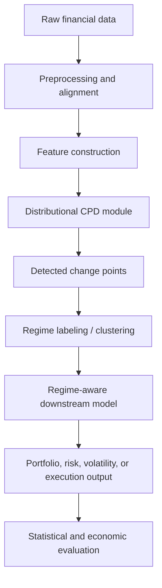
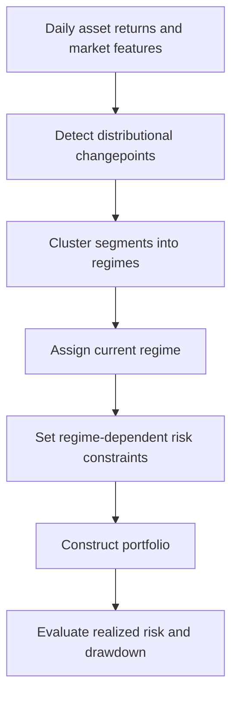

# Proposal: Distributional Regime Shift Detection for Adaptive Quant Decision Systems

## 1. Executive Summary

Financial markets are not stationary. The statistical relationships used by trading, portfolio construction, volatility forecasting, and risk-management models can break abruptly or gradually across market regimes. These breaks are often not simple mean shifts. They may appear as changes in volatility clustering, tail behavior, cross-asset dependence, liquidity, market impact, or factor exposure stability.

This project proposes a research framework for **distributional change point detection (CPD)** in quantitative finance, with a focus on detecting **regime shifts** that are economically meaningful for downstream models. The core idea is to treat each market regime as a probability distribution over financial states, then detect boundaries by comparing adjacent segment distributions using optimal transport, especially Wasserstein distances.

Building on the current proposal, which formulates CPD as a **global Wasserstein segmentation problem** rather than a local sliding-window test, we propose extending the framework toward finance-specific applications: regime-aware risk control, model governance, alpha signal validation, tail-risk monitoring, factor lifecycle diagnostics, covariance and volatility forecasting, and online market-state monitoring.

The central research question is:

> Can distributional change point detection identify financial regime shifts that improve downstream quant decisions, such as risk control, model retraining, signal allocation, factor monitoring, tail-risk estimation, and portfolio construction?

The project has three main contributions:

1. **Methodological contribution**: develop a global Wasserstein-based segmentation framework for detecting distributional market regime shifts.
2. **Finance-specific contribution**: adapt the detector to volatility, covariance, factor, and microstructure features.
3. **Empirical contribution**: evaluate not only statistical breakpoint accuracy, but also downstream economic value through risk-control decisions, retraining triggers, signal performance by regime, VaR/CVaR calibration, drawdown control, turnover, and portfolio outcomes.


## 2. Motivation

### 2.1 Why Change Point Detection Matters in Quant Finance

Many quant models rely on historical data. However, the usefulness of historical data depends on whether the market state has remained stable. When the underlying regime changes, old observations may become misleading.

Examples include:

- a low-volatility market transitioning into a crisis regime;
- equity correlations suddenly increasing during stress;
- factor premia decaying after crowding;
- liquidity evaporating during market shocks;
- market impact changing after volatility spikes;
- intraday order-flow behavior shifting after news or macro events.

In these cases, a model trained on stale data can suffer from:

- underestimated risk;
- poor covariance forecasts;
- excessive leverage;
- unstable portfolio weights;
- wrong hedge ratios;
- delayed response to volatility shocks;
- degraded execution performance.

Therefore, CPD should not be viewed only as a statistical task. In quant finance, its value comes from answering:

> When should a model stop trusting the previous regime and adapt?

### 2.2 Why Distributional CPD Instead of Mean-Shift CPD?

Classical change point methods often focus on changes in mean, variance, regression coefficients, or likelihood parameters. These are useful, but financial regime shifts are frequently more complex.

A market regime may change through:

```math
\text{tail thickness}, \quad
\text{skewness}, \quad
\text{cross-sectional dependence}, \quad
\text{volatility clustering}, \quad
\text{liquidity state}, \quad
\text{return distribution shape}.
```

Two regimes may have nearly identical mean and variance but very different downside risk or dependence structure.

For example:

```math
r_t \sim \mathcal{N}(0, \sigma^2)
```

and

```math
r_t \sim t_\nu(0, \tilde{\sigma}^2)
```

can be scaled to have similar first two moments, yet the second distribution has much fatter tails. A mean-variance detector may miss the shift, while a distributional metric such as Wasserstein distance, energy distance, or MMD may detect it.

This motivates the use of **distributional CPD** methods that compare empirical distributions rather than only moments.


## 3. Background and Literature Review

### 3.1 Classical CPD

Classical CPD methods can be grouped into parametric and nonparametric families.

Parametric methods assume a generative model, such as piecewise Gaussian means, ARMA models, switching linear systems, or regression models with structural breaks. Important references include:

- Bai and Perron-style multiple structural break models;
- likelihood-ratio and generalized likelihood-ratio tests;
- PELT and other penalized dynamic-programming methods;
- Bayesian online change point detection;
- Markov-switching and hidden Markov models.

These methods are strong baselines when the model is well specified. However, they may miss breaks that do not appear in the chosen sufficient statistics.

### 3.2 Nonparametric and Distributional CPD

Nonparametric CPD avoids specifying a full generative model. Instead, it uses two-sample tests or distributional distances between adjacent windows or segments.

Representative families include:

- kernel methods using MMD;
- energy-distance methods;
- density-ratio based methods;
- rank-based multivariate methods;
- optimal-transport and Wasserstein methods.

These are especially appealing for finance because financial regimes can differ in tails, dependence, and shape.

### 3.3 Optimal Transport and Wasserstein CPD

The current project builds on optimal transport. Given two distributions $p$ and $q$, the 2-Wasserstein distance is

```math
W_2(p,q)
=
\left(
\inf_{\pi \in \Pi(p,q)}
\int \lVert x-y \rVert_2^2 \, d\pi(x,y)
\right)^{1/2},
```

where $\Pi(p,q)$ is the set of couplings with marginals $p$ and $q$.

In one dimension, $W_2$ has a simple quantile representation:

```math
W_2^2(p,q)
=
\int_0^1
\left(F^{-1}(u)-G^{-1}(u)\right)^2du.
```

This makes univariate and sliced-Wasserstein implementations computationally attractive.

The current uploaded proposal formulates CPD as maximizing the total Wasserstein distance between adjacent segment distributions:

```math
\max_{\tau}
J(\tau)
=
\sum_{i=1}^{S-1}
W_2^2(\mu_i(\tau), \mu_{i+1}(\tau)),
```

where $\tau$ denotes the set of change points and $\mu_i(\tau)$ is the empirical distribution of segment $i$.

This differs from local sliding-window methods because it optimizes the segmentation globally rather than scoring each candidate boundary independently.

### 3.4 Connection to Regime Modeling

Traditional regime models, such as HMMs or Markov-switching models, assume a latent state process. CPD takes a complementary view: it estimates the times at which the data-generating process changes.

For finance, the two views can be combined:

```math
\text{CPD} \rightarrow \text{segment regimes}
\rightarrow \text{regime-specific forecasting / allocation model}.
```

The detected changepoints can initialize or regularize regime models. Conversely, HMM-like models can serve as strong baselines for comparing downstream value.


## 4. Research Problem

### 4.1 Problem Setup

Let

```math
X_1, X_2, \ldots, X_T
```

be a time series of financial state vectors, where each $X_t \in \mathbb{R}^d$. The feature vector may include:

```math
X_t =
[
r_t,
\sigma_t,
\text{volume}_t,
\text{spread}_t,
\text{order imbalance}_t,
\text{factor returns}_t,
\text{covariance features}_t
].
```

We assume the sequence is divided into unknown regimes:

```math
1 = \tau_0 < \tau_1 < \cdots < \tau_{S-1} < \tau_S = T.
```

Each segment

```math
T_i = \{X_t : \tau_{i-1} < t \leq \tau_i\}
```

has an empirical distribution

```math
\mu_i =
\frac{1}{\lvert T_i \rvert}
\sum_{t \in T_i}
\delta_{X_t}.
```

The goal is to estimate the change points

```math
\widehat{\tau}_1, \ldots, \widehat{\tau}_{S-1}
```

such that adjacent segments are distributionally different and the resulting regimes improve downstream financial models.

### 4.2 Core Objective

A basic global Wasserstein segmentation objective is:

```math
\max_{\tau}
\sum_{i=1}^{S-1}
W_2^2(\mu_i(\tau), \mu_{i+1}(\tau)).
```

However, this objective alone can overfit by creating very short segments. We therefore use a regularized version:

```math
\max_{\tau}
\sum_{i=1}^{S-1}
W_2^2(\mu_i(\tau), \mu_{i+1}(\tau))
-
\lambda S
-
\rho \sum_{i=1}^{S}\frac{1}{\lvert T_i \rvert}
-
\eta \cdot \text{TurnoverPenalty}(\tau).
```

The terms have the following roles:

- $\lambda S$: penalizes too many regimes;
- $\rho / \lvert T_i \rvert$: discourages tiny noisy segments;
- turnover penalty: discourages segmentations that would cause unstable portfolio decisions.

This makes the objective finance-aware.


## 5. Proposed Methodology

## 5.1 High-Level Pipeline



The pipeline has five stages:

1. **Data construction**  
   Build market state vectors from returns, volatility, covariance, factor, macro, or microstructure data.

2. **Distributional segmentation**  
   Detect changepoints by comparing adjacent segment distributions.

3. **Regime clustering**  
   Cluster segments into recurring regimes, such as calm, stress, recovery, liquidity shock, or high-correlation regimes.

4. **Downstream adaptation**  
   Use detected regimes to adjust risk constraints, retraining schedules, signal allocation, factor monitoring, tail-risk estimates, forecasting models, or execution strategies.

5. **Evaluation**  
   Measure both breakpoint accuracy and economic value.


## 5.2 Candidate CPD Algorithms

We propose benchmarking several method families.

### Classical Baselines

- PELT with Gaussian and robust losses;
- binary segmentation;
- wild binary segmentation;
- narrowest-over-threshold methods;
- Bai-Perron structural break tests;
- ICSS variance-shift detector.

### Probabilistic Baselines

- Bayesian online change point detection;
- HMM / Markov-switching models;
- switching linear dynamical systems.

### Distributional Baselines

- MMD-based kernel CPD;
- energy-distance CPD;
- density-ratio CPD;
- Wasserstein sliding-window CPD;
- sliced-Wasserstein CPD.

### Proposed Main Method

- global Wasserstein segmentation;
- sliced-Wasserstein extension;
- finance-aware regularization;
- optional online mini-batch variant;
- segment clustering using Wasserstein affinity.


## 5.3 Wasserstein Global Segmentation

The proposed method differs from local window scanning.

### Local Scanning

Local scanning computes a statistic at each candidate time $t$:

```math
\sigma(t)
=
D(\widehat{\mu}_{t-\beta:t}, \widehat{\mu}_{t:t+\beta}),
```

where $D$ is a discrepancy measure and $\beta$ is a window size.

This is simple and online-friendly, but it treats each candidate boundary independently.

### Global Segmentation

Global segmentation optimizes over all boundaries jointly:

```math
\widehat{\tau}
=
\arg\max_\tau
\sum_{i=1}^{S-1}
D(\mu_i(\tau), \mu_{i+1}(\tau))
-
\text{Penalty}(\tau).
```

This can produce more coherent segmentations and reduce duplicate detections around one crisis.


## 5.4 Multivariate Extension

Full high-dimensional Wasserstein distance is expensive and statistically difficult. We propose three practical extensions.

### Option 1: Coordinate-Wise Wasserstein

Compute univariate Wasserstein distance for each feature and average:

```math
D(\mu_i,\mu_j)
=
\frac{1}{d}
\sum_{k=1}^d
W_2^2(\mu_i^{(k)}, \mu_j^{(k)}).
```

This is simple but discards dependence.

### Option 2: Sliced Wasserstein

Project data onto random directions $\theta_m$:

```math
D_{\text{SW}}(\mu_i,\mu_j)
=
\frac{1}{M}
\sum_{m=1}^M
W_2^2(
\theta_m^\top \mu_i,
\theta_m^\top \mu_j
).
```

This preserves more multivariate structure while remaining computationally tractable.

### Option 3: Feature-Space Wasserstein

First embed market states:

```math
z_t = f_\phi(X_t),
```

then compute Wasserstein distances in embedding space.

The embedding $f_\phi$ may be:

- PCA;
- autoencoder;
- contrastive representation;
- factor-model residual embedding;
- covariance or correlation eigenvalue embedding.

This option connects naturally with regime-aware covariance forecasting.


## 5.5 Regime Clustering

After detecting change points, we obtain segments:

```math
T_1, T_2, \ldots, T_S.
```

We then cluster segment distributions using a Wasserstein affinity matrix:

```math
A_{ij}
=
\exp
\left(
-
\frac{D(\mu_i,\mu_j)}{\tau}
\right).
```

Then apply spectral clustering or soft clustering to assign regime labels:

```math
c_i \in \{1,2,\ldots,K\}.
```

This allows repeated regimes to be identified. For example:

- calm low-volatility regime;
- high-volatility crisis regime;
- recovery regime;
- liquidity-stress regime;
- high-correlation contagion regime.


## 5.6 Downstream Regime-Aware Decision Modules

The detector becomes useful only when the detected regimes change downstream decisions. After CPD identifies changepoints and clusters the resulting segments into recurring regimes, each time point receives a regime label or soft regime posterior. The downstream layer then asks:

> Given the current regime, what should the quant system do differently?

We propose evaluating several downstream modules. These are ordered by practical promise rather than by connection to any single prior project.

### Direction 1: Regime-Aware Risk Control and Portfolio Constraints

This is the most immediately applicable direction. The detected regime controls the amount of risk the portfolio is allowed to take, rather than only changing a covariance estimate.

For example, in a calm regime the system may allow normal leverage, normal concentration, and normal rebalance frequency. In a stress or liquidity-stress regime, it may reduce gross exposure, tighten position bounds, increase diversification, raise transaction-cost assumptions, or require a larger cash buffer.

A regime-aware portfolio problem can be written as:

```math
\min_w
\quad
w^\top \widehat{\Sigma}_t w
```

subject to regime-dependent constraints:

```math
\mathbf{1}^{\top}w = 1,
\qquad
\lVert w \rVert_1 \leq L(c_t),
\qquad
w_{\min}(c_t) \leq w_i \leq w_{\max}(c_t),
```

where $c_t$ is the current detected regime. The key output is not only a portfolio, but also a risk recommendation such as **keep normal exposure**, **tighten leverage**, **reduce turnover**, or **trigger stress testing**.

### Direction 2: Regime-Aware Model Governance and Retraining

CPD can act as a model-staleness detector. Instead of retraining models on a fixed calendar schedule, the system retrains or recalibrates only when the data distribution has changed enough.

A simple decision rule is:

```math
a_t =
\begin{cases}
\text{keep model}, & \text{if no meaningful regime shift is detected},\\
\text{recalibrate model}, & \text{if a moderate shift is detected},\\
\text{retrain model and reduce risk}, & \text{if a major shift is detected}.
\end{cases}
```

This is relevant for alpha models, risk models, volatility models, execution-cost models, factor models, and portfolio optimizers. The empirical question is whether CPD-triggered retraining improves out-of-sample performance compared with fixed monthly or rolling-window retraining.

### Direction 3: Regime-Aware Alpha Signal Validation and Allocation

Many alpha signals are regime-dependent. A signal may appear weak on average but perform strongly in specific regimes, or a signal may decay because the market has entered a regime where its mechanism no longer works.

For a signal score $s_t$ and future return $r_{t+1}$, we can estimate regime-conditional performance:

```math
IC_k
=
\mathrm{Corr}(s_t, r_{t+1} \mid c_t = k).
```

The downstream system can then allocate capital conditionally:

```math
\omega_j(c_t)
\propto
\max\{0, \widehat{IC}_{j,c_t}\},
```

where $\omega_j(c_t)$ is the capital or risk allocation to signal $j$ in regime $c_t$. This direction connects regime detection to strategy selection: momentum, mean reversion, carry, value, quality, lead-lag, and liquidity signals may each have different regime profiles.

### Direction 4: Regime-Aware Tail-Risk, VaR, and CVaR Forecasting

Regime labels can also improve tail-risk estimation. Instead of estimating VaR and CVaR from all historical observations, the model can emphasize observations from regimes similar to the current one.

A regime-conditioned CVaR estimator can be written as:

```math
\widehat{\mathrm{CVaR}}_{\alpha,t}
=
\mathbb{E}
\left[
L_s
\mid
L_s \geq \widehat{\mathrm{VaR}}_{\alpha,t},
\ c_s \approx c_t
\right],
```

where $L_s$ is portfolio loss and $c_s \approx c_t$ means that past observations come from the same or similar regimes. This is especially useful when calm-period data underestimates crisis-period loss distributions.

### Direction 5: Regime-Aware Factor Lifecycle Monitoring

For factor investing and risk modeling, the detected regimes can be used to monitor whether factor behavior remains stable. The system can track factor return distributions, exposure stability, residual distributions, factor crowding, and attribution drift across regimes.

A rolling factor model is:

```math
r_{i,t}
=
\alpha_i
+
\beta_i^{\top} f_t
+
\epsilon_{i,t}.
```

CPD can be applied to factor returns, estimated betas, residuals, or cross-sectional attribution errors. The downstream action could be to reduce a factor's weight, re-estimate exposures, increase monitoring, or flag a factor as unstable.

### Direction 6: Regime-Aware Covariance and Volatility Forecasting

Covariance and volatility forecasting remain important downstream tasks, but they should be treated as one application rather than the only application.

A regime-weighted covariance estimator is:

```math
\widehat{\Sigma}_t
=
\sum_{s < t}
w_{s,t} \, r_s r_s^{\top},
```

with weights such as:

```math
w_{s,t}
\propto
\exp(-D(z_s,z_t)/\tau)
\cdot
p(c_s = c_t).
```

This uses historical observations that are distributionally similar to the current regime, instead of relying only on a fixed rolling window.

### Direction 7: Execution, Liquidity, and Online Regime Alerts

For intraday data, the same framework can detect liquidity shocks, spread widening, order-flow imbalance regimes, or market-impact regimes. The downstream decision is execution control: slow down execution, reduce child order size, use more passive orders, widen quotes, or avoid providing liquidity during toxic-flow regimes.

This direction is highly practical but requires higher-frequency data and careful online evaluation.


## 6. Proposed Experiments

## 6.1 Experiment 1: Synthetic Distributional Breaks

### Goal

Test whether Wasserstein CPD detects breaks that classical mean/variance detectors miss.

### Data Generation

Generate piecewise distributions with controlled shifts:

#### Mean shift

```math
X_t \sim \mathcal{N}(\mu_1, \Sigma)
\quad \rightarrow \quad
X_t \sim \mathcal{N}(\mu_2, \Sigma).
```

#### Variance shift

```math
X_t \sim \mathcal{N}(0, \Sigma_1)
\quad \rightarrow \quad
X_t \sim \mathcal{N}(0, \Sigma_2).
```

#### Tail shift

```math
X_t \sim \mathcal{N}(0,1)
\quad \rightarrow \quad
X_t \sim t_\nu(0,s^2),
```

scaled so both regimes have similar variance.

#### Mixture shift

```math
X_t \sim 0.5\mathcal{N}(-a,1)+0.5\mathcal{N}(a,1)
```

to

```math
X_t \sim 0.8\mathcal{N}(-a,1)+0.2\mathcal{N}(a,1).
```

#### Copula shift

Keep marginals fixed but change dependence structure:

```math
C_1(u,v) \rightarrow C_2(u,v).
```

### Baselines

- PELT;
- WBS;
- MMD CPD;
- energy-distance CPD;
- sliding-window Wasserstein;
- proposed global Wasserstein method.

### Metrics

- breakpoint precision and recall;
- F1 score within tolerance window;
- Hausdorff distance;
- false positive rate;
- runtime;
- sensitivity to minimum segment length.

### Expected Result

The proposed method should be especially strong when regimes differ in tails, mixture structure, or dependence while preserving first moments.


## 6.2 Experiment 2: Daily Market Regime Discovery and Event Alignment

### Goal

Detect major market regimes in daily asset, factor, volatility, and macro features, then evaluate whether the detected regimes are stable, interpretable, and aligned with known market events.

### Data

Public data options:

- Fama-French factors;
- industry portfolio returns;
- ETF returns;
- FRED macro variables;
- VIX or volatility proxies if available.

Licensed extensions:

- CRSP daily equity returns;
- WRDS-based equity universe;
- OptionMetrics implied volatility surface features.

### Features

```math
X_t =
[
r_t,
\lvert r_t \rvert,
r_t^2,
\text{realized volatility}_t,
\text{factor returns}_t,
\text{macro changes}_t,
\text{correlation features}_t
].
```

### Tasks

1. Detect changepoints.
2. Cluster segments into recurring regimes.
3. Compare detected regimes to known stress periods.
4. Measure regime stability under resampling and alternative feature sets.
5. Produce interpretable regime summaries.

### Baselines

- HMM / Markov-switching models;
- PELT;
- WBS;
- MMD CPD;
- energy-distance CPD;
- sliding-window Wasserstein CPD;
- proposed global Wasserstein CPD.

### Evaluation

- event alignment around known stress periods;
- segment stability;
- regime persistence;
- out-of-sample regime assignment consistency;
- regime interpretability through feature summaries.


## 6.3 Experiment 3: Regime-Aware Risk Control and Portfolio Constraints

### Goal

Test whether detected regimes improve portfolio risk control by adapting constraints, leverage, turnover limits, and exposure caps.

### Pipeline



### Regime-Dependent Constraint Examples

```math
\lVert w_t \rVert_1 \leq L(c_t),
\qquad
\mathrm{Turnover}(w_t,w_{t-1}) \leq U(c_t),
```

and

```math
w_{\min}(c_t)
\leq
w_{i,t}
\leq
w_{\max}(c_t).
```

In calm regimes, the constraints may be looser. In stress or liquidity regimes, leverage, concentration, and turnover limits become tighter.

### Baselines

- fixed portfolio constraints;
- volatility-threshold risk controls;
- drawdown-threshold de-risking;
- HMM-based regime constraints;
- proposed CPD-regime constraints.

### Metrics

- realized variance;
- maximum drawdown;
- CVaR;
- turnover;
- transaction-cost-adjusted return;
- leverage stability;
- frequency of unnecessary de-risking;
- performance during stress periods.

### Expected Result

This experiment tests whether CPD regimes are useful as **decision constraints**, not merely as forecast features. It is one of the most practical downstream applications because it maps directly to portfolio and risk-management actions.


## 6.4 Experiment 4: Regime-Aware Model Governance and Retraining

### Goal

Evaluate whether CPD-triggered retraining improves model robustness compared with fixed retraining schedules.

### Setup

Choose one or more forecasting or scoring models, such as:

- volatility forecasting model;
- return or alpha scoring model;
- factor exposure model;
- transaction-cost model;
- covariance or risk model.

At each time $t$, the CPD system recommends one of the following actions:

```math
a_t \in
\{
\text{keep model},
\text{recalibrate},
\text{retrain},
\text{retrain and reduce risk}
\}.
```

### Baselines

- fixed monthly retraining;
- fixed quarterly retraining;
- rolling-window retraining;
- volatility-threshold retraining;
- HMM-triggered retraining;
- proposed CPD-triggered retraining.

### Metrics

- post-shift forecast loss;
- time-to-recovery after detected shifts;
- unnecessary retraining rate;
- model degradation before retraining;
- cost-adjusted portfolio or forecast performance;
- stability of model parameters.

### Expected Result

This direction is highly applicable because production quant systems need rules for when models have become stale. The paper can show that distributional changepoints are useful operational signals, not only statistical breakpoints.


## 6.5 Experiment 5: Regime-Aware Alpha, Factor, and Tail-Risk Diagnostics

### Goal

Use detected regimes to explain when signals, factors, or tail-risk models work or fail.

### Part A: Alpha Signal Validation

For each signal $j$, estimate its regime-conditional performance:

```math
IC_{j,k}
=
\mathrm{Corr}(s_{j,t}, r_{t+1} \mid c_t = k).
```

Then test whether regime-conditioned signal allocation improves performance:

```math
\omega_j(c_t)
\propto
\max\{0,\widehat{IC}_{j,c_t}\}.
```

### Part B: Factor Lifecycle Monitoring

Apply CPD and regime clustering to:

- factor return distributions;
- rolling betas;
- residual distributions;
- cross-sectional attribution errors;
- factor drawdowns and crowding proxies.

Evaluate whether regime labels identify factor instability earlier than rolling regression diagnostics.

### Part C: Tail-Risk Forecasting

Estimate VaR and CVaR using observations from similar regimes:

```math
\widehat{\mathrm{CVaR}}_{\alpha,t}
=
\mathbb{E}
\left[
L_s
\mid
L_s \geq \widehat{\mathrm{VaR}}_{\alpha,t},
\ c_s \approx c_t
\right].
```

### Baselines

- unconditional signal performance;
- rolling-window signal validation;
- Bai-Perron structural break tests;
- rolling factor regression diagnostics;
- historical VaR/CVaR;
- volatility-scaled VaR/CVaR;
- HMM-regime diagnostics.

### Metrics

- regime-conditional information coefficient;
- alpha Sharpe by regime;
- factor exposure stability;
- post-break factor model $R^2$;
- attribution drift;
- VaR violation rate;
- CVaR loss;
- stress-period tail calibration.

### Expected Result

This experiment package is broader than covariance forecasting. It tests whether distributional regimes help explain **which signals work, which factors are unstable, and when tail-risk estimates should become more conservative**.


## 6.6 Experiment 6: Intraday Liquidity Regimes and Online Alerts

### Goal

Develop an online version that can be used as a real-time alert layer for execution, liquidity, and market-state monitoring.

### Data

Public options:

- Binance minute or tick data;
- crypto order book snapshots if available.

Licensed options:

- TAQ;
- LOBSTER;
- CME futures data.

### Features

```math
X_t =
[
\text{return}_t,
\text{realized volatility}_t,
\text{spread}_t,
\text{depth}_t,
\text{order imbalance}_t,
\text{signed volume}_t,
\text{trade intensity}_t
].
```

### Online Output

At each time $t$, the system produces:

```math
P(\text{changepoint at } t),
```

a regime label:

```math
\widehat{c}_t,
```

and a recommended action:

```math
a_t \in
\{
\text{normal execution},
\text{slow execution},
\text{reduce child order size},
\text{use passive orders},
\text{widen quotes},
\text{avoid toxic flow}
\}.
```

### Baselines

- rolling z-score alarms;
- BOCPD;
- robust online CPD;
- kernel CPD;
- Wasserstein local detector;
- HMM liquidity regimes.

### Metrics

- detection delay;
- false alarm rate;
- average run length;
- realized spread prediction error;
- market-impact prediction error;
- implementation shortfall;
- slippage reduction in simulated execution.

### Expected Result

This direction is highly practical and product-like, but it is more data-intensive. It is a strong extension after the daily-data decision-system experiments are established.


## 7. Methodological Extensions

## 7.1 Finance-Aware Penalty Design

A generic CPD method penalizes the number of changepoints. In finance, we can add penalties that reflect decision costs.

Possible penalty:

```math
\mathcal{P}(\tau)
=
\lambda S
+
\rho \sum_i \frac{1}{\lvert T_i \rvert}
+
\eta \sum_t \lVert w_t(\tau)-w_{t-1}(\tau) \rVert_1.
```

This discourages segmentations that look statistically attractive but cause excessive trading turnover.

## 7.2 Dependence-Aware Calibration

Financial data are serially dependent. Standard two-sample thresholds often assume i.i.d. samples.

We should consider:

- block bootstrap;
- circular bootstrap;
- stationary bootstrap;
- HAC-style variance correction;
- prewhitening;
- residual-based CPD after fitting volatility models.

## 7.3 Tail-Robust Wasserstein Features

To reduce sensitivity to outliers, use:

- winsorized features;
- robust scaling;
- Student-$t$ residuals;
- clipped transport cost;
- CVaR-aware distributional distances.

## 7.4 Multi-Scale CPD

Regime shifts occur at different horizons:

- tick-level liquidity regimes;
- intraday volatility regimes;
- daily risk regimes;
- monthly macro regimes.

A multi-scale framework can combine detectors:

```math
S_t =
\alpha_1 S_t^{tick}
+
\alpha_2 S_t^{intraday}
+
\alpha_3 S_t^{daily}.
```

This could produce a richer regime state.


## 8. Evaluation Framework

## 8.1 Statistical Metrics

For synthetic data with known changepoints:

- precision;
- recall;
- F1 score;
- localization error;
- Hausdorff distance;
- false positive rate;
- detection delay.

For real data:

- event alignment;
- regime persistence;
- stability under resampling;
- consistency across related assets;
- segment clustering quality.

## 8.2 Forecasting and Risk Metrics

For volatility:

```math
\text{QLIKE}
=
\frac{\widehat{\sigma}_t^2}{\sigma_t^2}
-
\log
\left(
\frac{\widehat{\sigma}_t^2}{\sigma_t^2}
\right)
-
1.
```

For covariance:

- Frobenius loss;
- Stein loss;
- Gaussian KL;
- log-Euclidean loss.

For tail risk:

- VaR violation rate;
- VaR coverage calibration;
- CVaR loss;
- stress-period drawdown;
- tail-loss ranking accuracy.

## 8.3 Decision and Portfolio Metrics

- realized variance;
- annualized Sharpe;
- maximum drawdown;
- turnover;
- transaction-cost-adjusted return;
- leverage stability;
- exposure drift;
- unnecessary de-risking rate;
- time-to-recovery after regime shifts;
- retraining frequency and retraining efficiency.

## 8.4 Signal and Factor Diagnostics

- regime-conditional information coefficient;
- alpha Sharpe by regime;
- factor return stability;
- factor exposure stability;
- post-break factor model $R^2$;
- attribution drift;
- cross-sectional rank correlation decay;
- factor drawdown by regime.


## 9. Expected Contributions

The project can be positioned at three levels.

### Contribution 1: New CPD Methodology

A global Wasserstein segmentation framework that improves over local sliding-window tests by jointly optimizing changepoint locations.

### Contribution 2: Finance-Specific Regime Detection

A CPD framework designed for financial regimes that may differ in tails, dependence, volatility, and liquidity rather than only mean.

### Contribution 3: Decision-Oriented Evaluation

A benchmark showing whether detected changepoints improve downstream quant decisions, including risk-control constraints, model retraining triggers, alpha signal allocation, factor monitoring, tail-risk calibration, and portfolio outcomes.


## 10. Research Risks and Mitigation

| Risk | Why it matters | Mitigation |
|---|---|---|
| Wasserstein computation is expensive | Full OT does not scale well in high dimension | Use sliced Wasserstein, entropic OT, embeddings, or coordinate-wise approximations |
| CPD overfits crisis periods | Detectors may split one crisis into many nearby breaks | Add minimum segment length and finance-aware penalties |
| Real changepoints have no ground truth | Market regimes are latent | Use synthetic truth plus downstream economic validation |
| Mean-return improvement may be weak | Return prediction is difficult | Evaluate decision-oriented tasks such as risk control, retraining, signal gating, tail-risk calibration, and factor stability |
| Serial dependence invalidates thresholds | Financial samples are not i.i.d. | Use block bootstrap and residual-based calibration |
| Decision rules may overreact | Frequent regime changes can cause overtrading, unnecessary retraining, or excessive de-risking | Include turnover penalties, retraining-cost metrics, false-alert analysis, and transaction-cost-adjusted metrics |


## 11. Target Venues

### Best Initial Target: ICAIF

This project is highly suitable for ICAIF if the paper emphasizes:

- financial regime detection;
- adaptive risk-control decisions;
- model governance and retraining triggers;
- signal and factor diagnostics by regime;
- realistic market data;
- decision-oriented evaluation.

### ML / Statistics Targets

If the method becomes theoretically strong:

- AISTATS;
- ICML;
- NeurIPS workshops or main conference;
- UAI;
- KDD.

### Finance / Econometrics Journals

If the empirical finance contribution becomes substantial:

- Journal of Financial Econometrics;
- Journal of Computational Finance;
- Journal of Econometrics;
- Management Science;
- Quantitative Finance.


## 12. Proposed Timeline

| Phase | Duration | Deliverables |
|---|:---:|---|
| Phase 1: Literature and baseline setup | 2 weeks | baseline CPD implementations, clean benchmark design |
| Phase 2: Synthetic experiments | 2–3 weeks | controlled distributional break benchmark |
| Phase 3: Daily market regime experiments | 3 weeks | public-data regime detection and event analysis |
| Phase 4: Downstream decision modules | 4 weeks | risk-control constraints, retraining triggers, and signal/factor diagnostics |
| Phase 5: Method refinement | 3 weeks | sliced-Wasserstein, finance-aware penalties, online variants, ablations |
| Phase 6: Writing and submission | 3–4 weeks | full paper draft, figures, tables, appendix |


## 13. Recommended First Version of the Project

The most feasible and publishable first version is:

> **Distributional Regime Shift Detection for Adaptive Quant Decision Systems**

This version keeps the methodological core of Wasserstein CPD, but avoids positioning the project as only a covariance-forecasting paper. The first version should demonstrate that detected distributional regimes are useful for multiple downstream decisions.

### First Paper Scope

Use:

- synthetic distributional breaks;
- public daily factor, ETF, and industry portfolio data;
- regime discovery and event alignment;
- regime-aware risk-control constraints;
- CPD-triggered model retraining or recalibration;
- regime-conditional alpha, factor, or tail-risk diagnostics.

Compare:

- PELT;
- WBS;
- kernel CPD;
- energy-distance CPD;
- HMM / Markov-switching regimes;
- rolling-window or calendar-based decision rules;
- proposed global Wasserstein CPD.

Show:

- Wasserstein CPD detects moment-invariant distributional shifts;
- detected regimes are stable and economically interpretable;
- regime labels improve at least two downstream decisions;
- adaptive decisions reduce drawdowns, improve tail-risk calibration, reduce model staleness, or improve regime-conditioned signal allocation;
- gains survive turnover, transaction cost, false-alert, and retraining-cost controls.

### Suggested Core Experiments for Version 1

A focused first paper could use three core experiments:

1. **Synthetic distributional breaks** to verify that the detector finds tail, mixture, and dependence shifts.
2. **Daily market regime discovery** to show interpretable regimes around stress and recovery periods.
3. **Two downstream decision tasks**, preferably:
   - regime-aware risk-control constraints; and
   - CPD-triggered model governance or regime-aware signal/factor diagnostics.

Covariance and volatility forecasting can still appear as supporting tasks, but they should not be the only downstream evidence.

## 14. Conclusion

This project should be framed as a **decision-oriented regime detection framework**, not just a new changepoint detector.

The key message is:

> Financial regime shifts are often distributional. By detecting changes in the geometry of market-state distributions, we can build adaptive quant systems that know when historical data have become stale and when downstream decisions should change.

The most promising path is to connect Wasserstein CPD with a broader adaptive decision layer:

```math
\text{Distributional CPD}
\rightarrow
\text{Regime discovery}
\rightarrow
\text{Adaptive decision layer}
\rightarrow
\text{Improved risk, model, signal, and portfolio outcomes}.
```

The downstream layer can include risk-control constraints, model retraining triggers, alpha signal allocation, factor lifecycle monitoring, tail-risk estimation, covariance and volatility forecasting, and online execution alerts. If the empirical results show that detected regimes improve multiple decision tasks, the project has a strong chance as an ICAIF-style paper and can later be extended toward a more theoretical ML/statistics submission.


## References

### Change Point Detection and Structural Breaks

- Adams, R. P., and MacKay, D. J. C. (2007). *Bayesian Online Changepoint Detection*. arXiv: https://arxiv.org/abs/0710.3742
- Bai, J., and Perron, P. (1998). *Estimating and Testing Linear Models with Multiple Structural Changes*. Econometrica.
- Bai, J., and Perron, P. (2003). *Computation and Analysis of Multiple Structural Change Models*. Journal of Applied Econometrics.
- Barry, D., and Hartigan, J. A. (1993). *A Bayesian Analysis for Change Point Problems*. Journal of the American Statistical Association.
- Fearnhead, P. (2006). *Exact and Efficient Bayesian Inference for Multiple Changepoint Problems*. Statistics and Computing.
- Fryzlewicz, P. (2014). *Wild Binary Segmentation for Multiple Change-Point Detection*. Annals of Statistics.
- Hamilton, J. D. (1989). *A New Approach to the Economic Analysis of Nonstationary Time Series and the Business Cycle*. Econometrica.
- Inclán, C., and Tiao, G. C. (1994). *Use of Cumulative Sums of Squares for Retrospective Detection of Changes of Variance*. Journal of the American Statistical Association.
- Killick, R., Fearnhead, P., and Eckley, I. A. (2012). *Optimal Detection of Changepoints With a Linear Computational Cost*. Journal of the American Statistical Association.
- Matteson, D. S., and James, N. A. (2014). *A Nonparametric Approach for Multiple Change Point Analysis of Multivariate Data*. Journal of the American Statistical Association.
- Truong, C., Oudre, L., and Vayatis, N. (2020). *Selective Review of Offline Change Point Detection Methods*. Signal Processing.
- Wang, T., and Samworth, R. J. (2018). *High Dimensional Change Point Estimation via Sparse Projection*.

### Optimal Transport and Wasserstein Methods

- Ambrosio, L., Gigli, N., and Savaré, G. (2008). *Gradient Flows in Metric Spaces and in the Space of Probability Measures*.
- Bonneel, N., Rabin, J., Peyré, G., and Pfister, H. (2015). *Sliced and Radon Wasserstein Barycenters of Measures*.
- Cheng, K. C., Aeron, S., Hughes, M. C., Hussey, E., and Miller, E. L. (2020). *Optimal Transport Based Change Point Detection and Time Series Segment Clustering*.
- Cuturi, M. (2013). *Sinkhorn Distances: Lightspeed Computation of Optimal Transport*.
- Peyré, G., and Cuturi, M. (2019). *Computational Optimal Transport*.
- Ramdas, A., García Trillos, N., and Cuturi, M. (2015). *On Wasserstein Two-Sample Testing and Related Families of Nonparametric Tests*.
- Villani, C. (2009). *Optimal Transport: Old and New*.
